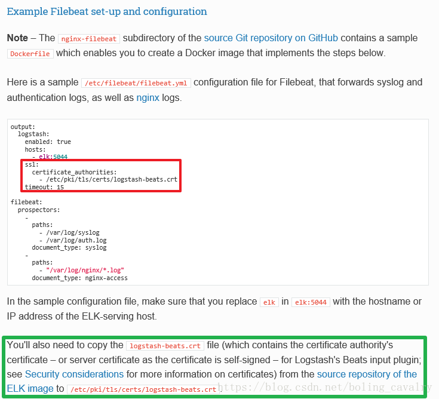
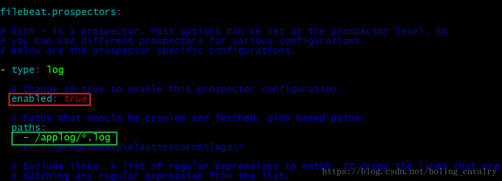
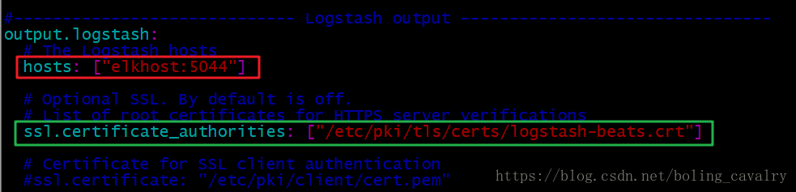
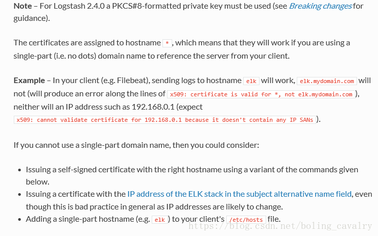
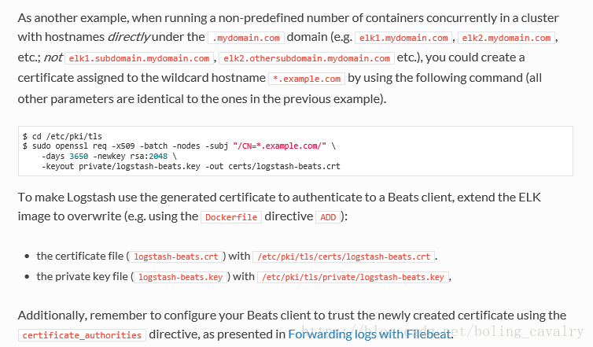

<https://blog.csdn.net/boling_cavalry/article/details/79972444?utm_source=blogxgwz7>

## 核心技术点
前一章中，之所以能通过一个docker-compose.yml将整个环境运行起来，所依赖的核心技术点为以下三个docker镜像：

1. sebp/elk：这是ELK Server的镜像；
2. bolingcavalry/springboot-app-filebeat：我们将web工程做成docker镜像的时候，都以bolingcavalry/springboot-app-filebeat作为基础镜像，这里面集成了filebeat，还有个启动脚本，可以先后启动filebeat和web工程；
3. bolingcavalry/elkdemo：这个镜像中有web工程，启动后就相当于启动了web工程，该镜像的本质是将web工程复制到bolingcavalry/springboot-app-filebeat镜像中；

## 列举所有技术点
我们开门见山，将实现前一章体验用到的技术点列举出来：

1. hub.docker.com镜像仓库中的sebp/elk，已集成了Elasticsearch, Logstash, Kibana，创建的容器直接作为ELK的server使用；
2. 制作一个镜像，起名为bolingcavalry/springboot-app-filebeat，这里面装好了filebeat，将web应用产生的日志上报到ELK server上去；
3. 基于springboot的web工程，在构建的时候使用docker-maven-plugin插件，将web工程制作成一个docker镜像，注意：基础镜像使用步骤2中的bolingcavalry/springboot-app-filebeat；
4. 制作docker-compose.yml，将步骤1和步骤3中的镜像配置进来，再配置好link；
5. 至此，所有材料就准备完成了，用docker-compose up -d命令即可开始前一章中的体验；
接下来我们将上面几点逐个展开细说；

## ELK server
ELK server镜像的tag是623，代表6.2.3版本，下载命令：docker pull sebp/elk:623，有兴趣的同学可以去看一下对应的Dockerfile，地址：https://hub.docker.com/r/sebp/elk/~/dockerfile/
```shell
docker run -p 5601:5601 -p 9200:9200 -p 5044:5044 -it --name elk --network host -v 709d0129d82f04df11f743c526b607410c2318f391eddd3dcf7028030f96b724 sebp/elk:623

docker run -p 5601:5601 -p 9200:9200 -p 5044:5044 -it --name elk --network host sebp/elk:623

```

### 制作带有filebeat服务的基础镜像bolingcavalry/springboot-app-filebeat
制作该镜像的是本文的主要内容，制作前我们列出镜像的功能：

1. 装好了JDK；
2. 装好了filebeat；
3. filebeat有权限将日志上报到ELK server；
4. 时区要正确；
5. 容器启动后，filebeat自动启动，并且扫描指定路径下的*.log文件；
6. filebeat启动后，web应用自动启动，提供web服务，并且将日志输出在filebeat扫描的路径下；

以上就是bolingcavalry/springboot-app-filebeat镜像的所有功能，在编写Dockerfile脚本之前，我们先准备好制作镜像所需的材料；

您可以在GitHub下载这些材料，地址和链接信息如下表所示：

| 名称   |  链接  |  备注  |
|:---|:---|:---|
|  项目主页  |  https://github.com/zq2599/blog_demos  |  该项目在GitHub上的主页  |
|git仓库地址(https)|	https://github.com/zq2599/blog_demos.git|	该项目源码的仓库地址，https协议|
|git仓库地址(ssh)	|git@github.com:zq2599/blog_demos.git|	该项目源码的仓库地址，ssh协议|

这个git项目中有多个目录，本次所需的资源放在filebeat_springboot_image_files目录下，如下图红框所示：

接下来，将这些材料的来源和加工步骤逐一说清楚，这些是制作镜像的关键；

## JDK
不用安装JDK了，直接使用JDK的官方镜像作为基础镜像就好：java:8u111-jdk；

## 关于filebeat访问ELK的权限
filebeat日志上传到ELK是需要权限的，怎样才能获取权限呢？

请参考官方文档的说明，如下图：



上图红框中是filebeat.yml中的配置信息，要增加ssl节点的配置，并且要指定/etc/pki/tls/certs/目录下的logstash-beats.crt文件，这是个什么文件呢？
绿框中说明了logstash-beats.crt的出处：在elk镜像源码的git仓库中，地址是https://github.com/spujadas/elk-docker；

因此，我们要把logstash-beats.crt文件下载下来，在制作镜像时放在/etc/pki/tls/certs/目录下；

## filebeat
在官网下载6.2.2版本，地址：https://artifacts.elastic.co/downloads/beats/filebeat/filebeat-6.2.2-linux-x86_64.tar.gz，下载完毕后解压，然后修改其中的filebeat.yml文件：

如下图，enabled设置为true，paths设置为/applog/*.log，今后filebeat就从这个目录下搜集日志，所以我们的web工程中也要把日志输出目录设置成/applog/：



如下图，红框中的elkhost，是docker启动时候的link参数，通过elkhost即可访问ELK server，绿框中就是前面提到的，ELK访问权限对应的crt文件路径：



## 启动filebeat和web应用的脚本：filebeat-springboot-entrypoint.sh
脚本filebeat-springboot-entrypoint.sh，在docker容器启动的时候执行，这样就能让fliebeat和web应用在容器启动后也自动启动了：
```
echo "start filebeat now ..."
nohup /opt/filebeat-6.2.2-linux-x86_64/filebeat -e -c /opt/filebeat-6.2.2-linux-x86_64/filebeat.yml >/dev/null 2>&1 &
echo "start springboot jar now ..."
java -jar $1
```

上述shell脚本先用nohup后台启动filebeat，再用java命令启动基于springboot的jar包，jar包的名字是shell的入参，这里要注意：bolingcavalry/springboot-app-filebeat只是web镜像的基础镜像而已，它并不知道web工程的jar包的名称，所以jar包的名称是在shell脚本被调用的时候，由调用方传入的；

调用方是谁呢？我们在制作web工程的镜像时，可以指定容器启动时执行的shell，此时可以指定这个shell，再把jar包的名字作为参数传入即可；

web工程的镜像怎么制作呢？后面会讲到，先来看看其中调用shell脚本的那一段：
```
<!--镜像的FROM，使用bolingcavalry/springboot-app-filebeat:0.0.3-->
<baseImage>bolingcavalry/springboot-app-filebeat:0.0.3</baseImage>
<!--该镜像的容器启动后，直接运行spring boot工程-->
<entryPoint>["sh","/filebeat-springboot-entrypoint.sh","/${project.build.finalName}.jar"]</entryPoint>
```

如上所示，这是maven工程的pom.xml的一段，baseImage标签指定了基础镜像，entryPoint标签指定了启动容器时要执行的shell命令，jar包的名称是maven项目的名称；

至此，制作镜像bolingcavalry/springboot-app-filebeat所需的材料已经准备完毕，来编写Dockerfile吧；

###bolingcavalry/springboot-app-filebeat镜像的Dockerfile
Dockerfile脚本的内容如下，由于每行都加了注释，就不多赘述了：

```
# Docker file for filebeat and springboot from bolingcavalry # VERSION 0.0.1
# Author: bolingcavalry

#基础镜像
FROM java:8u111-jdk

#作者
MAINTAINER BolingCavalry <zq2599@gmail.com>

#定义日志文件存放目录，这个要和web应用的日志配置一致
ENV APP_LOG_PATH /applog

#定义证书文件目录，这个要和filebeat.yml的配置一致
ENV FILE_BEAT_CRT_PATH /etc/pki/tls/certs

#定义filebeat文件夹名称
ENV FILE_BEAT_PACKAGE_NAME filebeat-6.2.2-linux-x86_64

#定义证书文件名称
ENV FILE_BEAT_CRT_NAME logstash-beats.crt

#定义启动文件名称
ENV ENTRYPOINT_FILE_NAME filebeat-springboot-entrypoint.sh

#定义时区参数
ENV TZ=Asia/Shanghai

#设置时区
RUN ln -snf /usr/share/zoneinfo/$TZ /etc/localtime && echo $TZ > /etc/timezone

#使之生效
RUN . /etc/profile

#创建日志目录文件夹
RUN mkdir $APP_LOG_PATH

#存放证书的文件夹
RUN mkdir -p $FILE_BEAT_CRT_PATH

#从当前目录將证书文件复制到镜像中
COPY ./$FILE_BEAT_CRT_NAME $FILE_BEAT_CRT_PATH/

#从当前目录將filebeat文件复制到镜像中
COPY ./$FILE_BEAT_PACKAGE_NAME /opt/$FILE_BEAT_PACKAGE_NAME

#复制启动文件
COPY ./$ENTRYPOINT_FILE_NAME /$ENTRYPOINT_FILE_NAME

#赋写权限
RUN chmod a+x /$ENTRYPOINT_FILE_NAME
```

如上所述，前面我们准备的材料在脚本都统统用上了；

将filebeat-6.2.2-linux-x86_64 文件夹、Dockerfile文件、filebeat-springboot-entrypoint.sh文件、logstash-beats.crt放在同一目录下，执行以下命令即可将镜像构建成功：
```
docker build -t bolingcavalry/springboot-app-filebeat:0.0.3 .
```
web服务工程所需的基础镜像已经构建成功，接下来我们构建web工程的镜像：bolingcavalry/elkdemo

## web工程的镜像
这里的web工程，是个maven构建的springboot工程，是个普通的springmvc服务，您也可以替换成自己想要的工程
#### 接下来简述一下web服务镜像的制作：

1. 用maven创建一个springboot的web工程；
2. 在目录src/main/resources下增加一个logback.xml文件，用于配置日志有关的参数：
```
<?xml version="1.0" encoding="UTF-8"?>
<configuration debug="true">
    <!-- 应用名称 -->
    <property name="APP_NAME" value="logtest" />
    <!-- 日志输出格式 -->
    <property name="ENCODER_PATTERN"
              value="%d{yyyy-MM-dd  HH:mm:ss.SSS} [%thread] %-5level %logger{80} - %msg%n" />
    <contextName>${APP_NAME}</contextName>

    <!-- 控制台日志：输出全部日志到控制台 -->
    <appender name="STDOUT" class="ch.qos.logback.core.ConsoleAppender">
        <encoder class="ch.qos.logback.classic.encoder.PatternLayoutEncoder">
            <Pattern>${ENCODER_PATTERN}</Pattern>
        </encoder>
    </appender>

    <!-- 文件日志：输出全部日志到文件 -->
    <appender name="FILE"
              class="ch.qos.logback.core.rolling.RollingFileAppender">
        <rollingPolicy class="ch.qos.logback.core.rolling.TimeBasedRollingPolicy">
            <fileNamePattern>/applog/output.%d{yyyy-MM-dd}.log</fileNamePattern>
            <maxHistory>7</maxHistory>
        </rollingPolicy>
        <encoder class="ch.qos.logback.classic.encoder.PatternLayoutEncoder">
            <pattern>${ENCODER_PATTERN}</pattern>
        </encoder>
    </appender>

    <root>
        <level value="INFO" />
        <appender-ref ref="STDOUT" />
        <appender-ref ref="FILE" />
    </root>
</configuration>
```
如上所示，日志文件的目录设置在/applog/，和filebeat.yml中搜集日志的目录保持一致；

#### 新增HelloController.java用于响应web请求，并且每次收到请求时都会打印一行日志：
```
@RestController
public class HelloController {
    protected static final Logger logger = LoggerFactory.getLogger(HelloController.class);

    @RequestMapping(value="/hello/{username}",method= RequestMethod.GET)
    public String hello(@PathVariable String username) {
        SimpleDateFormat sdf = new SimpleDateFormat("yyyy-MM-dd HH:mm:ss");
        String time = sdf.format(new Date());
        logger.info("execute hello from {} - {}", username, time);
        return "hello " + username + ", " + time;
    }
}
```

#### pom.xml中，新增一个插件docker-maven-plugin，用于将当前工程构建成的jar文件做成docker镜像文件：
```
<plugin>
        <groupId>com.spotify</groupId>
        <artifactId>docker-maven-plugin</artifactId>
        <version>0.4.12</version>
        <!--docker镜像相关的配置信息-->
        <configuration>
                <!--镜像名，这里用工程名-->
                <imageName>bolingcavalry/${project.artifactId}</imageName>
                <!--TAG,这里用工程版本号-->
                <imageTags>
                        <imageTag>${project.version}</imageTag>
                </imageTags>
                <!--镜像的FROM，使用bolingcavalry/springboot-app-filebeat:0.0.3-->
                <baseImage>bolingcavalry/springboot-app-filebeat:0.0.3</baseImage>
                <!--该镜像的容器启动后，直接运行spring boot工程-->
                <entryPoint>["sh","/filebeat-springboot-entrypoint.sh","/${project.build.finalName}.jar"]</entryPoint>
                <!--构建镜像的配置信息-->
                <resources>
                        <resource>
                                <targetPath>/</targetPath>
                                <directory>${project.build.directory}</directory>
                                <include>${project.build.finalName}.jar</include>
                        </resource>
                </resources>
        </configuration>
</plugin>
```
如上所示，web镜像的基础镜像是bolingcavalry/springboot-app-filebeat:0.0.3，启动时执行filebeat-springboot-entrypoint.sh，并且将自己工程的名称作为入参；

#### 在pom.xml文件所在目录执行以下命令，即可编译构建当前工程，并制作成docker镜像：
```
mvn clean package -U -DskipTests docker:build
```

#### 如果您对web工程制作成docker镜像的细节感兴趣，想把自己的web工程做成docker镜像，可以参考《 maven构建docker镜像三部曲》：

1. 《maven构建docker镜像三部曲之一：准备环境》；
2. 《maven构建docker镜像三部曲之二：编码和构建镜像》；
3. 《maven构建docker镜像三部曲之三：推送到远程仓库(内网和阿里云)》；

## 镜像都已做好，我们再来看看启动他们的docker-compose.yml

docker-compose.yml

```
version: '2'
services:
  elk:
    image: sebp/elk:622
    ports:
      - "5601:5601"
    restart: always
  webapp:
    image: bolingcavalry/elkdemo:0.0.1-SNAPSHOT
    depends_on:
      - elk
    links:
      - elk:elkhost
    ports:
      - "18080:8080"
    restart: always
```

1. ELK server容器的5601端口映射为当前电脑的5601端口，用于访问kibana；
2. web应用镜像使用link参数绑定ELK server容器，使用webapp作为域名的地方都会被解析为ELK server容器的IP地址；
3. web容器的8080映射为当前电脑的18080端口，访问当前电脑的18080端口即可访问web服务；

整个ELK环境所需的镜像和脚本都做好了，还有一个问题需要注意，否则有可能导致你的filebeat连接ELK server失败；

## 问题1：fliebeat与ELK server的连接问题
下图是 filebeat的filebeat.yml文件的内容，红框中的elkhost，是docker启动时候的link参数，在写这个参数的时候要注意两点：


1. 可以写成xxxxx的格式，例如：elkhost、abcdef这些都是可以的；
2. 不能写成xxxxx.xxxx的格式，例如：elkhost.com、abcdef.com这些都不可以；
具体原因参考官方解释：http://elk-docker.readthedocs.io/#security-considerations，如下图：



简单的说，我们用的那个logstash-beats.crt证书中，限定的域名格式为*，如果一定要使用elkhost.com这样的域名，只能自己制作，然后覆盖ELK server和fliebeat上现有的logstash-beats.crt，制作方式如下图：



至此，制作ELK环境的细节的实战就结束了，您可以用自己的web来实战一番，看看是否能更方便的搜索日志了；

接下来的章节，我们将ELK
server和web应用都搬到kubernetes环境上去，这样就更接近生产环境：多个web容器同时运行的时候，查日志不必再登录到每一台上去搜索了；

## 问题2： filebeat无法连接到logstash之取消证书
原因是filebeat使用证书只支持域名，不支持ip，所以我们取消证书

首先，在filebeat.yml中注释掉output中ssl开始的设置证书字段

其次，进入elk容器，进入/etc/logstash/conf.d中的02-beats-input.conf文件，删除掉如下ssl开头的三行
```
input {
  beats {
    port => 5044
    ssl => true
    ssl_certificate => "/etc/pki/tls/certs/logstash-beats.crt"
    ssl_key => "/etc/pki/tls/private/logstash-beats.key"
  }
}
```

### 问题3： 自定义日志的索引

首先，下filebeat.yml中定义一个field，如下的system: sys

```
- type: log

  # Change to true to enable this prospector configuration.
  enabled: true

  # Paths that should be crawled and fetched. Glob based paths.
  paths:
    - /logs/sys/*.log
    #- c:\programdata\elasticsearch\logs\*
  tags: ["sys"]
  fields:
      system: sys
```

其次，进入elk容器，进入/etc/logstash/conf.d中的30-output.conf文件，设置index变量如下：

```
output {
  elasticsearch {
    hosts => ["localhost:9200"]
    manage_template => false
    index => "%{[fields][system]}-%{+YYYY.MM.dd}"
    document_type => "%{[@metadata][type]}"
  }
}

```

### 问题4：max virtual memory areas vm.max_map_count [65530] is too low, increase to at least [262144]

```
解决：
切换到root用户
执行命令：
sysctl -w vm.max_map_count=262144

查看结果：
sysctl -a|grep vm.max_map_count

显示：
vm.max_map_count = 262144

上述方法修改之后，如果重启虚拟机将失效，所以：
解决办法：
在   /etc/sysctl.conf文件最后添加一行
vm.max_map_count=262144
即可永久修改
```

### 附件
    springboot-app-filebeat基础镜像的构建文件在res/docker目录下


