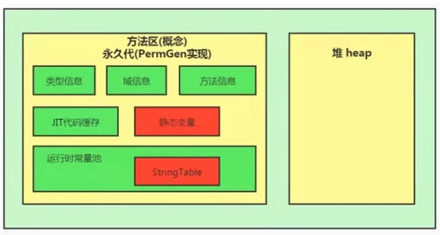

# 深入理解JVM虚拟机——Java内存模型结构之搞懂方法区

方法区（Method Area）
与Java堆一样，是各个线程共享的内存区域，它用于存储已被虚拟机加载的类型信息、常量、静态变量、即时编译器编译后的代码缓存等数据。虽然《Java虚拟机规范》中把方法区描述为堆的一个逻辑部分，但是它却有一个别名叫作“非堆”（Non-Heap），目的是与Java堆区分开来。

## 目录

栈、堆、方法区的交互关系

方法区的理解

设置方法区大小与 OOM

方法区的内部结构

方法区使用举例

方法区的演进细节

方法区垃圾回收

## 栈、堆、方法区的交互关系


代码演示

```java
public class AppMain {
    //运行时，JVM把AppMain的信息都放入方法区        
    public static void main(String[] args) {
// main成员方法本身放入方法区。            
        Sample test1 = new Sample(" 测试1 ");
// test1是引用，所以放到栈区里，Sample是自定义对象应该放到堆里面            
        Sample test2 = new Sample(" 测试2 ");
        test1.printName();
        test2.printName();
    }
}
```

```java
// Sample.java       
public class Sample {
//运行时，JVM把appmain的信息都放入方法区。                
    private name;

    // new Sample实例后，name引用放入栈区里，name对象放入堆里。         
    public Sample(String name) {
        this.name = name;
    }

    public void printName() {// printName()成员方法本身放入方法区里。            
        System.out.println(name);
    }
}
```

### JVM执行具体流程

系统收到了我们发出的指令，启动了一个Java虚拟机进程，这个进程首先从classpath中找到AppMain.class文件，读取这个文件中的二进制数据，然后把Appmain类的类信息存放到运行时数据区的方法区中。这一过程称为AppMain类的加载过程。

接着，JVM定位到方法区中AppMain类的Main()方法的字节码，开始执行它的指令。

这个main()方法的第一条语句就是：
Sample test1 = new Sample(“测试1”);语句很简单，就是让JVM创建一个Sample实例，并且呢，使引用变量test1引用这个实例
貌似小case一桩哦，就让我们来跟踪一下JVM，看看它究竟是怎么来执行这个任务的:

1）、Java虚拟机一看，不就是建立一个Sample类的实例吗，简单，于是就直奔方法区（方法区存放已经加载的类的相关信息，如类、静态变量和常量）而去，先找到Sample类的类型信息再说。结果呢，嘿嘿，没找到@@，这会儿的方法区里还没有Sample类呢（即Sample类的类信息还没有进入方法区中）。可JVM也不是一根筋的笨蛋，于是，它发扬“自己动手，丰衣足食”的作风，立马加载了Sample类，
把Sample类的相关信息存放在了方法区中。

2）、Sample类的相关信息加载完成后。Java虚拟机做的第一件事情就是在堆中为一个新的Sample类的实例分配内存，这个Sample类的实例持有着指向方法区的Sample类的类型信息的引用（Java中引用就是内存地址）。这里所说的引用，实际上指的是Sample类的类型信息在方法区中的内存地址，其实，就是有点类似于C语言里的指针啦~~
，而这个地址呢，就存放了在Sample类的实例的数据区中。

3）、在JVM中的一个进程中，每个线程都会拥有一个方法调用栈，用来跟踪线程运行中一系列的方法调用过程，栈中的每一个元素被称为栈帧，每当线程调用一个方法的时候就会向方法栈中压入一个新栈帧。这里的帧用来存储方法的参数、局部变量和运算过程中的临时数据。OK，原理讲完了，就让我们来继续我们的跟踪行动！位于“=”前的test1是一个在main()
方法中定义的变量，可见，它是一个局部变量，因此，test1这个局部变量会被JVM添加到执行main()
方法的主线程的Java方法调用栈中。而“=”将把这个test1变量指向堆区中的Sample实例，也就是说，test1这个局部变量持有指向Sample类的实例的引用（即内存地址）。

4）、JVM将继续执行后续指令，在堆区里继续创建另一个Sample类的实例，然后依次执行它们的printName()
方法。当JVM执行test1.printName()
方法时，JVM根据局部变量test1持有的引用，定位到堆中的Sample类的实例，再根据Sample类的实例持有的引用，定位到方法区中Sample类的类型信息（包括①类，②静态变量，③静态方法，④常量和⑤成员方法），从而获取printName()
成员方法的字节码，接着执行printName()成员方法包含的指令。

## 方法区的理解

在《Java虚拟机规范》中明确说明，“尽管所有的方法区在逻辑上属于堆的一部分，但一些简单的实现可能不会选择去进行垃圾收集或者进行压缩”。但对于
HotSpot 虚拟机而言，方法区还有一个别名叫做 Non-Heap（非堆），目的就是要和堆分开。

所以，方法区可以看做是一块独立于 Java 堆的内存空间。

运行时数据区

方法区主要存放的是 Class ，而堆中主要存放的是实例化的对象

方法区（Method Area） 与 Java堆 一样，是各个线程共享的内存区域。

方法区在JVM启动的时候被创建，并且它的实际的物理内存空间中和Java堆区一样都可以是不连续的。

方法区的大小，跟堆空间一样，可以选择固定大小或者可扩展。

方法区的大小决定了系统可以保存多少个类，如果系统定义了太多的类，导致方法区溢出，虚拟机同样会抛出内存溢出错误：
Java.lang.OutofMemoryError：PermGen space 或者 java.lang.OutOfMemoryError:Metaspace 加载大量的第三方的 jar
包，Tomcat部署的工程过多（30~50个），大量动态的生成反射类

关闭JVM就会释放这个区域的内存。

## 设置方法区大小与 OOM

方法区的大小不必是固定的，JVM可以根据应用的需要动态调整。
jdk7及以前

通过-xx:Permsize来设置永久代初始分配空间。默认值是20.75M

-XX:MaxPermsize来设定永久代最大可分配空间。32位机器默认是64M，64位机器模式是82M

当JVM加载的类信息容量超过了这个值，会报异常OutofMemoryError:PermGen space。

JDK8以后

元数据区大小可以使用参数 -XX:MetaspaceSize 和 -XX:MaxMetaspaceSize指定，注意等于号，是赋值操作。


默认值依赖于平台。windows下，-XX:MetaspaceSize是21M（约数），-XX:MaxMetaspaceSize的值是-1，即没有限制。

与永久代不同，如果不指定大小，默认情况下，虚拟机会耗尽所有的可用系统内存。如果元数据区发生溢出，虚拟机一样会抛出异常
OutOfMemoryError:Metaspace

-XX:MetaspaceSize：设置初始的元空间大小。对于一个64位的服务器端JVM来说，其默认的 -xx:
MetaspaceSize值为21MB。这就是初始的高水位线，一旦触及这个水位线，Ful1GC将会被触发并卸载没用的类（即这些类对应的类加载器不再存活）然后这个高水位线将会重置。新的高水位线的值取决于GC后释放了多少元空间。如果释放的空间不足，那么在不超过MaxMetaspaceSize时，适当提高该值。如果释放空间过多，则适当降低该值。

如果初始化的高水位线设置过低，上述高水位线调整情况会发生很多次。通过垃圾回收器的日志可以观察到Ful1GC多次调用。为了避免频繁地GC，建议将-XX:
MetaspaceSize设置为一个相对较高的值。

## 如何解决这些OOM

1. 要解决ooM异常或heap space的异常，一般的手段是首先通过内存映像分析工具（如Ec1ipse Memory
   Analyzer）对dump出来的堆转储快照进行分析，重点是确认内存中的对象是否是必要的，也就是要先分清楚到底是出现了内存泄漏（Memory
   Leak）还是内存溢出（Memory Overflow）


2. 内存泄漏就是 有大量的引用指向某些对象，但是这些对象以后不会使用了，但是因为它们还和GC
   ROOT有关联，所以导致以后这些对象也不会被回收，这就是内存泄漏的问题

如果是内存泄漏，可进一步通过工具查看泄漏对象到GC
Roots的引用链。于是就能找到泄漏对象是通过怎样的路径与GCRoots相关联并导致垃圾收集器无法自动回收它们的。掌握了泄漏对象的类型信息，以及GCRoots引用链的信息，就可以比较准确地定位出泄漏代码的位置。

3.

如果不存在内存泄漏，换句话说就是内存中的对象确实都还必须存活着，那就应当检查虚拟机的堆参数（-Xmx与-Xms），与机器物理内存对比看是否还可以调大，从代码上检查是否存在某些对象生命周期过长、持有状态时间过长的情况，尝试减少程序运行期的内存消耗。

## 方法区的内部结构

### 类型信息

对每个加载的类型（ 类 class、接口 interface、枚举 enum、注解 annotation），JVM 必须在方法区中存储以下类型信息：

这个类型的完整有效名称（全名=包名.类名）

这个类型直接父类的完整有效名（对于 interface 或是 java. lang.Object ，都没有父类）

这个类型的修饰符（ public ， abstract， final 的某个子集）

这个类型直接接口的一个有序列表

### 域（Field）信息

JVM必须在方法区中保存类型的所有域（field，也称为属性）的相关信息以及域的声明顺序；

域的相关信息包括：域名称、 域类型、域修饰符（public， private，protected， static， final， volatile， transient 的某个子集）

方法（Method）信息

JVM 必须保存所有方法的以下信息，同域信息一样包括声明顺序：

### 方法名称

方法的返回类型（或void）

方法参数的数量和类型（按顺序）

方法的修饰符（public， private， protected， static， final，synchronized， native ， abstract 的一个子集）

方法的字节码（bytecodes）、操作数栈、局部变量表及大小（ abstract 和 native 方法除外）

异常表（ abstract 和 native 方法除外）每个异常处理的开始位置、结束位置、代码处理在程序计数器中的偏移地址、被捕获的异常类的常量池索引

non-final 的类变量

静态变量和类关联在一起，随着类的加载而加载，他们成为类数据在逻辑上的一部分

类变量被类的所有实例所共享，即使没有类实例你也可以访问它。

我们可以通过例子来查看：

```java
public class MethodAreaDemo2 {
    public static void main(String[] args) {
        Order order = null;
        order.hello();
        System.out.println(order.count);
    }
}

class Order {
    public static int count = 1;
    public static final int number = 2;

    public static void hello() {
        System.out.println("hello!");
    }
```

运行结果为：

```java
hello!1

```

可以打开 IDEA 的 Terminal 窗口，在 MethodAreaDemo2.class 所在的路径下，输入 javap -v -p MethodAreaDemo2.class 命令


通过图片我们可以看出被声明为 final 的类变量的处理方法是不一样的，全局常量在编译的时候就被分配了。

## 运行时常量池

说到运行时常量池，我们先来了解一下什么是常量池表。

常量池表

一个有效的字节码文件中除了包含类的版本信息、字段、方法以及接口等描述信息外，还包含一项信息那就是常量池表（Constant Pool
Table），里边存储着数量值、字符串值、类引用、字段引用和方法引用。

为什么字节码文件需要常量池？

java
源文件中的类、接口，编译后会产生一个字节码文件。而字节码文件需要数据支持，通常这种数据会很大，以至于不能直接存放到字节码中。换一种方式，可以将指向这些数据的符号引用存到字节码文件的常量池中，这样字节码只需使用常量池就可以在运行时通过动态链接找到相应的数据并使用。

运行时常量池

运行时常量池（ Runtime Constant
Pool）是方法区的一部分，类加载器加载字节码文件时，将常量池表加载进方法区的运行时常量池。运行时常量池中包含多种不同的常量，包括编译期就已经明确的数值字面量，也包括到运行期解析后才能够获得的方法或者字段引用。此时不再是常量池中的符号地址了，这里换为真实地址。

运行时常量池，相对于 Class 文件常量池的另一重要特征是：具备动态性，比如 String.intern()。

演进细节
针对的是 Hotspot 的虚拟机：

jdk1.6 及之前：有永久代 ，静态变量存放在永久代上；

jdk1.7：有永久代，但已经逐步“去永久代”，字符串常量池、静态变量移除，保存在堆中；

jdk1.8及之后：无永久代，类型信息、字段、方法、常量保存在本地内存的元空间，但字符串常量池、静态变量仍在堆中；

演变示例图



## 为什么要将永久代替换为元空间呢?
永久代使用的是 JVM 的内存，受 JVM
设置的内存大小限制；元空间使用的是本地直接内存，它的最大可分配空间是系统可用内存的空间。因为元空间里存放的是类的元数据，所以随着内存空间的增大，能加载的类就更多了，相应的溢出的机率会大大减小。

在 JDK8，合并 HotSpot 和 JRockit 的代码时，JRockit 从来没有一个叫永久代的东西，合并之后就没有必要额外的设置这么一个永久代的地方了。

对永久代进行调优是很困难的。

StringTable 为什么要调整
因为永久代的回收效率很低，在 full gc 的时候才会触发。而 full GC 是老年代的空间不足、永久代不足时才会触发。这就导致了StringTable
回收效率不高。而我们开发中会有大量的字符串被创建，回收效率低，导致永久代内存不足。放到堆里，能及时回收内存。

### 垃圾回收
相对而言，垃圾收集行为在这个区域是比较少出现的，但并非数据进入方法区后就“永久存在”了。方法区的垃圾收集主要回收两部分内容：常量池中废奔的常量和不再使用的类型。

方法区内常量池中主要存放字面量和符号引用两大类常量：

字面量比较接近 Java 语言层次的常量概念，如文本字符串、被声明为 final 的常量值等。

符号引用则属于编译原理方面的概念，包括类和接口的全限定名、字段的名称和描述符、方法的名称和描述符。

HotSpot 虚拟机对常量池的回收策略是很明确的，只要常量池中的常量没有被任何地方引用，就可以被回收。

### 类型判定
判定一个常量是否“废弃”还是相对简单，而要判定一个类型是否属于“不再被使用的类”的条件就比较苛刻了。需要同时满足下面三个条件：

该类所有的实例都已经被回收，也就是 Java 堆中不存在该类及其任何派生子类的实例；

加载该类的类加载器已经被回收，这个条件除非是经过精心设计的可替换类加载器的场景，如OSGi、JSP的重加载等，否则通常是很难达成的；

该类对应的 java.lang.Class 对象没有在任何地方被引用，无法在任何地方通过反射访问该类的方法。

Java 虛拟机被允许对满足上述三个条件的无用类进行回收，这里说的仅仅是“被允许”，而并不是和对象一样，没有引用了就必然会回收。