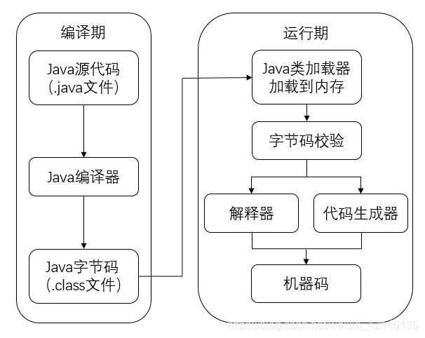
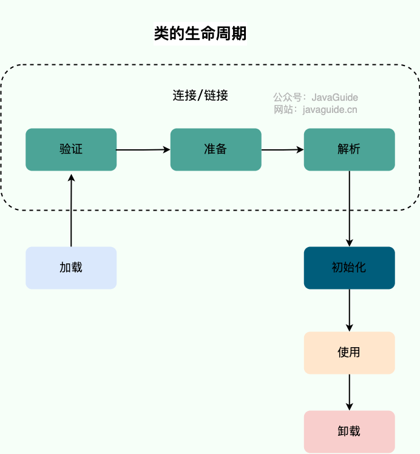
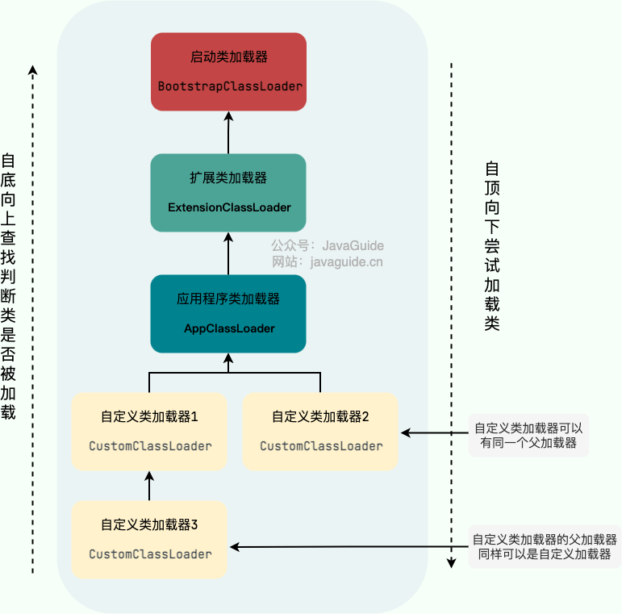

# Java类加载器
## 一、Java代码的执行过程
### 1.1 执行过程图


### 1.1 类生命周期


> 加载是类加载过程的第一步，主要完成下面 3 件事情：
> 1. 通过全类名获取定义此类的二进制字节流
> 2. 将字节流所代表的静态存储结构转换为方法区的运行时数据结构
> 3. 在内存中生成一个代表该类的 Class 对象，作为方法区这些数据的访问入口

## 二、类加载器
### 2.1 类加载器介绍

类加载器是一个负责加载类的对象。ClassLoader 是一个抽象类。给定类的二进制名称，类加载器应尝试定位或生成构成类定义的数据。典型的策略是将名称转换为文件名，
然后从文件系统中读取该名称的“类文件”。每个 Java 类都有一个引用指向加载它的 ClassLoader。不过，数组类不是通过 ClassLoader 创建的，而是 JVM 在需要的时候自动创建的，
数组类通过getClassLoader()方法获取 ClassLoader 的时候和该数组的元素类型的 ClassLoader 是一致的。

从上面的介绍可以看出:
- 类加载器是一个负责加载类的对象，用于实现类加载过程中的加载这一步。
- 每个 Java 类都有一个引用指向加载它的 ClassLoader。
- 数组类不是通过 ClassLoader 创建的（数组类没有对应的二进制字节流），是由 JVM 直接生成的。

>简单来说，类加载器的主要作用就是加载 Java 类的字节码（ .class 文件）到 JVM 中（在内存中生成一个代表该类的 Class 对象）。 
>字节码可以是 Java 源程序（.java文件）经过 javac 编译得来，也可以是通过工具动态生成或者通过网络下载得来。

### 2.2 类加载器加载规则
JVM 启动的时候，并不会一次性加载所有的类，而是根据需要去动态加载。也就是说，大部分类在具体用到的时候才会去加载，这样对内存更加友好。

对于已经加载的类会被放在 ClassLoader 中。在类加载的时候，系统会首先判断当前类是否被加载过。已经被加载的类会直接返回，否则才会尝试加载。也就是说，对于一个类加载器来说，相同二进制名称的类只会被加载一次。

### 2.3 双亲委派模型

> 双亲委派模型并不是一种强制性的约束，只是 JDK 官方推荐的一种方式。如果我们因为某些特殊需求想要打破双亲委派模型，也是可以的，后文会介绍具体的方法。
> 另外，类加载器之间的父子关系一般不是以继承的关系来实现的，而是通常使用组合关系来复用父加载器的代码。

### 2.4 双亲委派模型代码
```java
protected Class<?> loadClass(String name, boolean resolve)
    throws ClassNotFoundException
{
    synchronized (getClassLoadingLock(name)) {
        //首先，检查该类是否已经加载过
        Class c = findLoadedClass(name);
        if (c == null) {
            //如果 c 为 null，则说明该类没有被加载过
            long t0 = System.nanoTime();
            try {
                if (parent != null) {
                    //当父类的加载器不为空，则通过父类的loadClass来加载该类
                    c = parent.loadClass(name, false);
                } else {
                    //当父类的加载器为空，则调用启动类加载器来加载该类
                    c = findBootstrapClassOrNull(name);
                }
            } catch (ClassNotFoundException e) {
                //非空父类的类加载器无法找到相应的类，则抛出异常
            }

            if (c == null) {
                //当父类加载器无法加载时，则调用findClass方法来加载该类
                //用户可通过覆写该方法，来自定义类加载器
                long t1 = System.nanoTime();
                c = findClass(name);

                //用于统计类加载器相关的信息
                sun.misc.PerfCounter.getParentDelegationTime().addTime(t1 - t0);
                sun.misc.PerfCounter.getFindClassTime().addElapsedTimeFrom(t1);
                sun.misc.PerfCounter.getFindClasses().increment();
            }
        }
        if (resolve) {
            //对类进行link操作
            resolveClass(c);
        }
        return c;
    }
}
```
> JVM 判定两个 Java 类是否相同的具体规则：JVM 不仅要看类的全名是否相同，还要看加载此类的类加载器是否一样。只有两者都相同的情况，才认为两个类是相同的。即使两个类来源于同一个 Class 文件，
> 被同一个虚拟机加载，只要加载它们的类加载器不同，那这两个类就必定不相同。

### 2.5 双亲委派模型的好处
双亲委派模型保证了 Java 程序的稳定运行，可以避免类的重复加载（JVM 区分不同类的方式不仅仅根据类名，相同的类文件被不同的类加载器加载产生的是两个不同的类），
也保证了 Java 的核心 API 不被篡改。如果没有使用双亲委派模型，而是每个类加载器加载自己的话就会出现一些问题，比如我们编写一个称为 java.lang.Object 类的话，那么程序运行的时候，
系统就会出现两个不同的 Object 类。双亲委派模型可以保证加载的是 JRE 里的那个 Object 类，而不是你写的 Object 类。这是因为 AppClassLoader 在加载你的 Object 类时，会委托给 ExtClassLoader 去加载，
而 ExtClassLoader 又会委托给 BootstrapClassLoader，BootstrapClassLoader 发现自己已经加载过了 Object 类，会直接返回，不会去加载你写的 Object 类。

### 2.6 打破双亲委派模型方法
自定义加载器的话，需要继承 ClassLoader 。如果我们不想打破双亲委派模型，就重写 ClassLoader 类中的 findClass() 方法即可，无法被父类加载器加载的类最终会通过这个方法被加载。
但是，如果想打破双亲委派模型则需要重写 loadClass() 方法。为什么是重写 loadClass() 方法打破双亲委派模型呢？
双亲委派模型的执行流程已经解释了：
> 类加载器在进行类加载的时候，它首先不会自己去尝试加载这个类， 而是把这个请求委派给父类加载器去完成（调用父加载器 loadClass()方法来加载类）。

重写 loadClass()方法之后，我们就可以改变传统双亲委派模型的执行流程。例如，子类加载器可以在委派给父类加载器之前，先自己尝试加载这个类，或者在父类加载器返回之后，再尝试从其他地方加载这个类。
具体的规则由我们自己实现，根据项目需求定制化。

### 2.7 上下文类加载器
单纯依靠自定义类加载器没办法满足某些场景的要求，
例如，有些情况下，高层的类加载器需要加载低层的加载器才能加载的类。
比如，SPI 中，SPI 的接口（如 java.sql.Driver）是由 Java 核心库提供的，由BootstrapClassLoader 加载。
而 SPI 的实现（如com.mysql.cj.jdbc.Driver）是由第三方供应商提供的，它们是由应用程序类加载器或者自定义类加载器来加载的。
默认情况下，一个类及其依赖类由同一个类加载器加载。所以，加载 SPI 的接口的类加载器（BootstrapClassLoader）也会用来加载 SPI 的实现。按照双亲委派模型，
BootstrapClassLoader 是无法找到 SPI 的实现类的，因为它无法委托给子类加载器去尝试加载。再比如，假设我们的项目中有 Spring 的 jar 包，由于其是 Web 应用之间共享的，
因此会由 SharedClassLoader 加载（Web 服务器是 Tomcat）。我们项目中有一些用到了 Spring 的业务类，比如实现了 Spring 提供的接口、用到了 Spring 提供的注解。所以，
加载 Spring 的类加载器（也就是 SharedClassLoader）也会用来加载这些业务类。但是业务类在 Web 应用目录下，不在 SharedClassLoader 的加载路径下，
所以 SharedClassLoader 无法找到业务类，也就无法加载它们。
如何解决这个问题呢？ 这个时候就需要用到 线程上下文类加载器（ThreadContextClassLoader） 了。
拿 Spring 这个例子来说，当 Spring 需要加载业务类的时候，它不是用自己的类加载器，而是用当前线程的上下文类加载器。还记得我上面说的吗？每个 Web 应用都会创建一个单独的 WebAppClassLoader，
并在启动 Web 应用的线程里设置线程线程上下文类加载器为 WebAppClassLoader。这样就可以让高层的类加载器（SharedClassLoader）借助子类加载器（ WebAppClassLoader）来加载业务类，
破坏了 Java 的类加载委托机制，让应用逆向使用类加载器。线程线程上下文类加载器的原理是将一个类加载器保存在线程私有数据里，跟线程绑定，然后在需要的时候取出来使用。
这个类加载器通常是由应用程序或者容器（如 Tomcat）设置的。Java.lang.Thread 中的getContextClassLoader()和 setContextClassLoader(ClassLoader cl)分别用来获取和设置线程的上下文类加载器。
如果没有通过setContextClassLoader(ClassLoader cl)进行设置的话，线程将继承其父线程的上下文类加载器。
Spring 获取线程线程上下文类加载器的代码如下：
```java
Thread.currentThread().getContextClassLoader();
```

