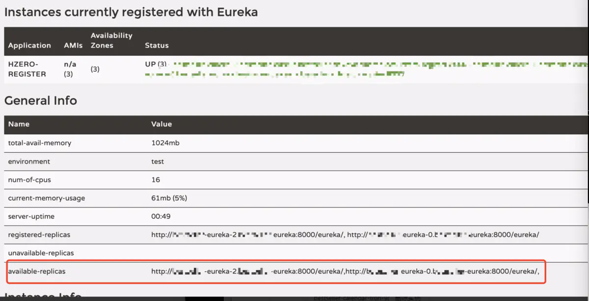

## 背景
对于一般的后端微服务来说，在k8s中同时起多个相同的服务来做负载均衡，只需要简单的修改deployment的replicas，增加pod数量，然后通过对外暴露一个service来代理这些pod。

而对于eureka来说，要实现eureka的高可用，那就不是修改replicas这么方便了。由于部署的多个eureka之间需要将自己注册到彼此，因此要做一些特殊改动。

主要是用到了StatefulSet和headless service这两个k8s对象

## StatefulSet、Headless Service简介：
### StatefulSet
StatefulSet是为了解决有状态服务的问题（对应Deployments和ReplicaSets是为无状态服务而设计），其应用场景包括

稳定的持久化存储，即Pod重新调度后还是能访问到相同的持久化数据，基于PVC来实现

稳定的网络标志，即Pod重新调度后其PodName和HostName不变，基于Headless Service（即没有Cluster IP的Service）来实现

有序部署，有序扩展，即Pod是有顺序的，在部署或者扩展的时候要依据定义的顺序依次依次进行（即从0到N-1，在下一个Pod运行之前所有之前的Pod必须都是Running和Ready状态），基于init containers来实现

有序收缩，有序删除（即从N-1到0）

StatefulSet中每个Pod的DNS格式为
```
statefulSetName-{0..N-1}.serviceName.namespace.svc.cluster.local
```

> serviceName为Headless Service的名字
> 0..N-1为Pod所在的序号，从0开始到N-1
> statefulSetName为StatefulSet的名字
> namespace为服务所在的namespace，Headless Service和StatefulSet必须在相同的namespace
> cluster.local为Cluster Domain

## Headless Service
Headless Service 和普通service的一个显著的区别是，Headless Service的对应的每一个Endpoints，即每一个Pod，都会有对应的DNS域名
例如：我们可以用过这种域名来访问某个具体的pod：
```
statefulSetName-0.serviceName.namespace.svc.cluster.local
```
在实际使用中，将service的clusterIP设置成None，就表明这个service是一个Headless Service。

## StatefulSet和Headless Service的结合
通过 StatefulSet，我们得到了一些列pod，每个pod的name为statefulSetName-{0..N-1}，
加入我们创建了一个名称叫eureka的StatefulSet，并且设置replicas =3，那么部署到k8s后，k8s会为我们生成三个名称依次为eureka-0，eureka-1，eureka-2的pod。
通过Headless Service，我们可以通过pod名称来访问某个pod，

例如，我们在namespace=test的命名空间下创建了一个名称为register-server的service，并且关联了之前StatefulSet创建的pod，那么我们可以在集群内任意地方
通过eureka-0.register-server.test.svc.cluster.local这个域名访问到eureka-0这个pod。

## 搭建：
有了前面的基础，现在部署eureka集群的方式就逐渐清晰了。

首先明确部署eureka的关键点：需要让每个eureka注册到另外的eureka上。
也就是eureka.client.serviceUrl.defaultZone这个配置，是一组eureka的地址。
通过StatefulSet，我们可以明确知道生成的每个eureka的名称，
通过Headless Service，我们又可以访问到每个eureka，所以eureka.client.serviceUrl.defaultZone的值就是
```
"http://eureka-0.register-server:8000/eureka/,http://eureka-1.register-server:8000/eureka/,http://eureka-2.register-server:8000/eureka/"
```
> 由于这三个pod在同一个命名空间内，可以省略.namespace.svc.cluster.local

有个这个配置，那么我们部署StatefulSet，和Headless Service
那么我们能基本能得到一个可用的eureka集群

除了会有以下问题：
红框中的可用副本（available-replicas）会出现在不可用unavailable-replicas中


原因是我们默认是通过ip的方式来注册eureka（eureka.instance.prefer-ip-address配置默认为true），但是eureka的注册地址又是域名的形式，两者不一致。
要解决这个问题，还需做一些额外的配置。

#### 1.在application.yaml中，将eureka.instance.prefer-ip-address设置成false。
```
 eureka:
     instance:
        prefer-ip-address: false
```
#### 2.StatefulSet.yaml中，增加环境变量配置，将pod的名称绑定到环境变量
```
 env:
  - name: MY_POD_NAME      
    valueFrom:
      fieldRef:
        fieldPath: metadata.name
```
#### 3.在application.yaml中指定eureka的 hostname,其中MY_POD_NAME取到了第二部中绑定的当前pod名称
```
eureka:
instance:
hostname: ${MY_POD_NAME}.register-server
```

如上配置后，便可以得到一个eureka集群。

后面是一些配置文件：
整体文件配置：

#### service.yaml
```
{{- if .Values.service.enabled }}
apiVersion: v1
kind: Service
metadata:
  name: {{ .Values.service.name }}
  labels:
{{ include "service.labels.standard" . | indent 4 }}
spec:
  clusterIP: None
  type: {{ .Values.service.type }}
  ports:
    - port: {{ .Values.service.port }}
      targetPort: http
      protocol: TCP
      name: http
  selector:
{{ include "service.labels.standard" . | indent 4 }}
{{- end }}

```

#### StatefulSet.yaml
```
apiVersion: apps/v1beta2
kind: StatefulSet
metadata:
  name: register-server
  labels:
{{ include "service.labels.standard" . | indent 4 }}
{{ include "service.logging.deployment.label" . | indent 4 }}
spec:
  replicas: {{ .Values.replicaCount }}
  serviceName: {{ .Values.service.name }}
  selector:
    matchLabels:
{{ include "service.labels.standard" . | indent 6 }}
  template:
    metadata:
      labels:
{{ include "service.labels.standard" . | indent 8 }}
{{ include "service.microservice.labels" . | indent 8 }}
      annotations:
{{ include "service.monitoring.pod.annotations" . | indent 8 }}
    spec:
      containers:
        - name: {{ .Release.Name }}
          image: "{{ .Values.image.repository }}:{{ .Chart.Version }}"
          imagePullPolicy: {{ .Values.image.pullPolicy }}
          env:
{{- range $name, $value := .Values.env.open }}
{{- if not (empty $value) }}
          - name: {{ $name | quote }}
            value: {{ $value | quote }}
{{- end }}
{{- end }}
          - name: MY_POD_NAME
            valueFrom:
              fieldRef:
                fieldPath: metadata.name
          ports:
            - name: http
              containerPort: {{ .Values.service.port }}
              protocol: TCP
          readinessProbe:
            httpGet:
              path: /actuator/health
              port: {{ .Values.deployment.managementPort }}
              scheme: HTTP
            failureThreshold: 3
            initialDelaySeconds: 60
            periodSeconds: 10
            successThreshold: 1
            timeoutSeconds: 10
          resources:
{{ toYaml .Values.resources | indent 12 }}
          volumeMounts:
          - mountPath: /Charts
            name: data
{{- if not (empty .Values.persistence.subPath) }}
            subPath: {{ .Values.persistence.subPath }}
{{- end }}
      volumes:
      - name: data
        {{- if .Values.persistence.enabled }}
        persistentVolumeClaim:
          claimName: {{ .Values.persistence.existingClaim | default ( .Release.Name ) }}
        {{- else }}
        emptyDir: {}
        {{- end }}
  podManagementPolicy: "Parallel"

```

#### Chart.yaml
```
apiVersion: v1
appVersion: "1.0"
description: A Helm chart for Kubernetes
name: register-server
version: 0.1.0
```

#### values.yaml
```
# Default values for hzero-register.
# This is a YAML-formatted file.
# Declare variables to be passed into your templates.

replicaCount: 3

image:
  repository: registry.choerodon.com.cn/hzero-hzero/hzero-register
  pullPolicy: Always

deployment:
  managementPort: 8001

env:
  open:
    # Eureka 注册中心地址
    EUREKA_DEFAULT_ZONE: "http://register-server-0.register-server:8000/eureka/,http://register-server-1.register-server:8000/eureka/,http://register-server-2.register-server:8000/eureka/"
    # 推荐 JVM 配置
    JAVA_OPTS: >
      -Xms1024m
      -Xmx1536m
metrics:
  path: /actuator/prometheus
  group: spring-boot

logs:
  parser: spring-boot

persistence:
  enabled: false
  ## A manually managed Persistent Volume and Claim
  ## Requires persistence.enabled: true
  ## If defined, PVC must be created manually before volume will be bound
  # existingClaim:
  # subPath:

service:
  enabled: true
  type: ClusterIP
  port: 8000
  name: register-server

ingress:
  enabled: false

resources:
  # We usually recommend not to specify default resources and to leave this as a conscious
  # choice for the user. This also increases chances charts run on environments with little
  # resources,such as Minikube. If you do want to specify resources,uncomment the following
  # lines,adjust them as necessary,and remove the curly braces after 'resources:'.
  limits:
    # cpu: 100m
    memory: 1.7Gi
  requests:
    # cpu: 100m
    memory: 1.2Gi
```

#### application.yml
```
eureka:
  instance:
    leaseRenewalIntervalInSeconds: 10
    leaseExpirationDurationInSeconds: 30
    metadata-map:
      VERSION: 1.0.0
    hostname: ${MY_POD_NAME}.register-server #设置eureka hostname
    prefer-ip-address: false #不使用ip注册，因为eureka相互注册的工程中，使用的服务名，例如register-server-0.register-server，如果使用ip注册，会导致eureka认为其他副本不可用，即eureka服务都会出现在unavailable-replicas中，而不是available-replicas中
  client:
    # 检索服务选项，注册中心不需要检索服务
    fetch-registry: ${EUREKA_CLIENT_FETCH_REGISTRY:true}
    # 注册中心将自己作为客户端来尝试注册自己，注册中心集群环境下需开启此配置
    register-with-eureka: ${EUREKA_CLIENT_REGISTER_WITH_EUREKA:true}
    serviceUrl:
      defaultZone: ${EUREKA_DEFAULT_ZONE:http://u2:9000/eureka,http://u1:8000/eureka} #这里在部署的时候会使用环境变量替换 EUREKA_DEFAULT_ZONE值
    registryFetchIntervalSeconds: 10
    disable-delta: true
  server:
    evictionIntervalTimerInMs: 4000
    enable-self-preservation: ${EUREKA_SERVER_ENABLE_SELF_PRESERVATION:false}
```

#### bootstrap.yml
```
spring:
  application:
    name: register-server
server:
  port: 8000
management:
  server:
    port: 8001
```

服务注册：
将一般的微服务注册到eureka集群中，可以通过eureka的service来访问eureka，即：将eureka.client.serviceUrl.defaultZone设置成register-server.test.svc.cluster.local，使用了k8s的service负载均衡，将服务注册到任意一个活着的eureka上，然后eureka集群内部会做同步，最终注册到eureka集群内部所有eureka上

转载：<https://www.jianshu.com/p/a3829851a97d>