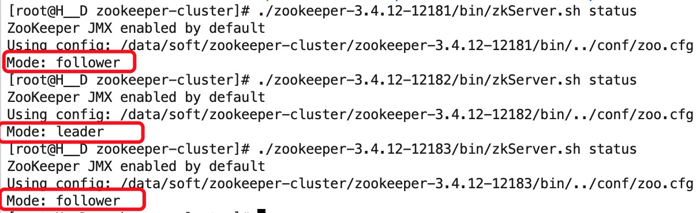

### ZooKeeper介绍
ZooKeeper是一个分布式的，开放源码的分布式应用程序协调服务，是Google的Chubby一个开源的实现，是Hadoop和Hbase的重要组件。它是一个为分布式应用提供一致性服务的软件，提供的功能包括：配置维护、域名服务、分布式同步、组服务等。

ZooKeeper的目标就是封装好复杂易出错的关键服务，将简单易用的接口和性能高效、功能稳定的系统提供给用户。

ZooKeeper包含一个简单的原语集， [1] 提供Java和C的接口。

官网：https://zookeeper.apache.org

### ZooKeeper安装
安装环境：

1、系统：CentOS 7.4

2、Java环境：JDK8

zookeeper有单机、伪集群、集群三种部署方式，本例使用的zookeeper版本是：zookeeper-3.4.12

#### 单机模式
1、下载ZooKeeper，地址：http://mirrors.hust.edu.cn/apache/zookeeper/

2、解压，命令：tar -zxvf zookeeper-3.4.12.tar.gz -C /data/soft/

解压后目录如下：


3、进入conf目录，创建一个zookeeper的配置文件zoo.cfg，可复制conf/zoo_sample.cfg作为配置文件
```
cd conf

cp zoo_sample.cfg zoo.cfg
```
配置文件说明：  

```
# The number of milliseconds of each tick
# tickTime：CS通信心跳数
# Zookeeper 服务器之间或客户端与服务器之间维持心跳的时间间隔，也就是每个 tickTime 时间就会发送一个心跳。tickTime以毫秒为单位。
tickTime=2000

# The number of ticks that the initial 
# synchronization phase can take
# initLimit：LF初始通信时限
# 集群中的follower服务器(F)与leader服务器(L)之间初始连接时能容忍的最多心跳数（tickTime的数量）。
initLimit=5

# The number of ticks that can pass between 
# sending a request and getting an acknowledgement
# syncLimit：LF同步通信时限
# 集群中的follower服务器与leader服务器之间请求和应答之间能容忍的最多心跳数（tickTime的数量）。
syncLimit=2

# the directory where the snapshot is stored.
# do not use /tmp for storage, /tmp here is just 
# example sakes.
# dataDir：数据文件目录
# Zookeeper保存数据的目录，默认情况下，Zookeeper将写数据的日志文件也保存在这个目录里。
dataDir=/data/soft/zookeeper-3.4.12/data


# dataLogDir：日志文件目录
# Zookeeper保存日志文件的目录。
dataLogDir=/data/soft/zookeeper-3.4.12/logs

# the port at which the clients will connect
# clientPort：客户端连接端口
# 客户端连接 Zookeeper 服务器的端口，Zookeeper 会监听这个端口，接受客户端的访问请求。
clientPort=2181

# the maximum number of client connections.
# increase this if you need to handle more clients
#maxClientCnxns=60
#
# Be sure to read the maintenance section of the 
# administrator guide before turning on autopurge.
#
# http://zookeeper.apache.org/doc/current/zookeeperAdmin.html#sc_maintenance
#
# The number of snapshots to retain in dataDir
#autopurge.snapRetainCount=3
# Purge task interval in hours
# Set to "0" to disable auto purge feature
#autopurge.purgeInterval=1


# 服务器名称与地址：集群信息（服务器编号，服务器地址，LF通信端口，选举端口）
# 这个配置项的书写格式比较特殊，规则如下：

# server.N=YYY:A:B  

# 其中N表示服务器编号，YYY表示服务器的IP地址，A为LF通信端口，表示该服务器与集群中的leader交换的信息的端口。B为选举端口，表示选举新leader时服务器间相互通信的端口（当leader挂掉时，其余服务器会相互通信，选择出新的leader）。一般来说，集群中每个服务器的A端口都是一样，每个服务器的B端口也是一样。但是当所采用的为伪集群时，IP地址都一样，只能时A端口和B端口不一样。
```

4、可以不修改zoo.cfg，默认配置就行，进去zookeeper安装目录，启动ZooKeeper
``` 　　　　　　
启动命令：./bin/zkServer.sh start

停止命令：./bin/zkServer.sh stop　　

重启命令：./bin/zkServer.sh restart

状态查看命令：./bin/zkServer.sh status
```

#### 伪集群模式
伪集群模式就是在同一主机启动多个zookeeper并组成集群

1、在同一台主机上，通过复制得到三个zookeeper实例  

　　　
2、对三个zookeeper节点进行配置

zookeeper1配置文件conf/zoo.cfg修改如下：  
```
tickTime=2000
initLimit=5
syncLimit=2
dataDir=/data/soft/zookeeper-cluster/zookeeper-3.4.12-12181/data
dataLogDir=/data/soft/zookeeper-cluster/zookeeper-3.4.12-12181/logs
clientPort=12181

server.1=127.0.0.1:12888:13888
server.2=127.0.0.1:14888:15888
server.3=127.0.0.1:16888:17888
```
注：server.1中的数字1为服务器的ID，需要与myid文件中的id一致，下一步将配置myid

zookeeper1的data/myid配置，使用如下命令（即新建一个文件data/myid，在其中添加内容为：1）：
zookeeper2的data/myid配置，使用如下命令：  

```
echo '1' > data/myid
```

zookeeper2配置文件conf/zoo.cfg修改如下：

```
tickTime=2000
initLimit=5
syncLimit=2
dataDir=/data/soft/zookeeper-cluster/zookeeper-3.4.12-12182/data
dataLogDir=/data/soft/zookeeper-cluster/zookeeper-3.4.12-12182/logs
clientPort=12182

server.1=127.0.0.1:12888:13888
server.2=127.0.0.1:14888:15888
server.3=127.0.0.1:16888:17888
```

zookeeper2的data/myid配置，使用如下命令：

```
 echo '2' > data/myid
```

zookeeper3配置文件conf/zoo.cfg修改如下：

```
tickTime=2000
initLimit=5
syncLimit=2
dataDir=/data/soft/zookeeper-cluster/zookeeper-3.4.12-12183/data
dataLogDir=/data/soft/zookeeper-cluster/zookeeper-3.4.12-12183/logs
clientPort=12183

server.1=127.0.0.1:12888:13888
server.2=127.0.0.1:14888:15888
server.3=127.0.0.1:16888:17888
```

zookeeper3的data/myid配置，使用如下命令： 

```
echo '3' > data/myid
```

3、分别启动三个zookeeper节点

4、查看节点状态
命令：./zookeeper-3.4.12-12181/bin/zkServer.sh status


#### 集群模式
集群模式就是在不同主机上安装zookeeper然后组成集群的模式，可以参考伪集群模式安装

1、在三台机器上分别部署1个ZooKeeper实例

2、zookeeper配置文件conf/zoo.cfg，如下：

```
tickTime=2000
initLimit=5
syncLimit=2
dataDir=/data/soft/zookeeper-3.4.12/data
dataLogDir=/data/soft/zookeeper-3.4.12/logs
clientPort=2181

server.1=127.0.0.1:2888:3888
server.2=127.0.0.2:2888:3888
server.3=127.0.0.3:2888:3888
```

3、zookeeper的data/myid配置，使用如下命令：

```
echo '1' > data/myid
```

当然zookeeper1 对应的是 1，zookeeper2 对应的是 2，zookeeper3 对应的是 3

4、分别启动三个zookeeper节点，即完成对ZooKeeper集群的安装

### ZooKeeper简单操作

下面操作在zookeeper单机模式下完成的

a、使用客户端连接ZooKeeper服务

命令：  
```
 ./bin/zkCli.sh -server 127.0.0.1:2181

 ./bin/zkCli.sh默认连接到本地127.0.0.1:2181
```


b、使用 ls 命令来查看当前 ZooKeeper 中所包含的内容：

命令：ls /


c、创建了一个新的 znode 节点“ zk ”以及与它关联的字符串

命令：create /zk myData


d、获取znode节点“ zk ”

命令：get /zk


e、删除znode节点“ zk ”

命令：delete /zk


f、推出客户端

命令：quit


