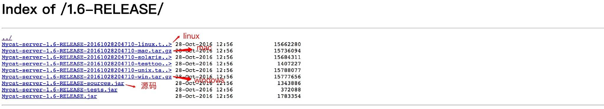
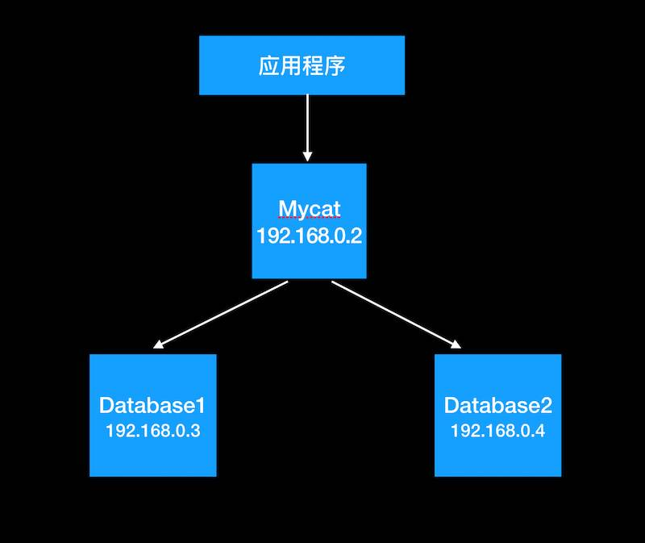

转载： <https://juejin.im/post/59c32516f265da065f04a4a4>

- 环境
    
    MyCat 1.6-RELEASE
    
    MySql 5.7.21
    
- 安装：

    根据不同的系统选择不同的版本。包括linux、windows、mac,作者考虑还是非常周全的，当然，也有源码版的。（ps:源码版的下载后，只要配置正确，就可以正常运行调试，这个赞一下。）
    
    
    Mycat的安装其实只要解压下载的目录就可以了，非常简单。
    安装完成后，目录如下：
    ```
        bin
        mycat命令，启动、重启、停止等
        
        catlet
        catlet为Mycat的一个扩展功能
        
        conf
        Mycat 配置信息,重点关注  
        
        lib
        Mycat引用的jar包，Mycat是java开发的
        
        logs
        日志文件，包括Mycat启动的日志和运行的日志。
    ```
    
- 配置

    Mycat的配置文件都在conf目录里面，这里介绍几个常用的文件：
    
    ```
        server.xml  Mycat的配置文件，设置账号、参数等
        
        schema.xml	Mycat对应的物理数据库和数据库表的配置
        
        rule.xml	Mycat分片（分库分表）规则
    ```
    
    Mycat的架构其实很好理解，Mycat是代理，Mycat后面就是物理数据库。和Web服务器的Nginx类似。对于使用者来说，访问的都是Mycat，不会接触到后端的数据库。
    我们现在做一个主从、读写分离，简单分表的示例。结构如下图：
    
    ```
      Mycat	192.168.0.2	mycat服务器，连接数据库时，连接此服务器
    
      database1	192.168.0.3	物理数据库1，真正存储数据的数据库
    
      database2	192.168.0.4	物理数据库2，真正存储数据的数据库
    ```
    Mycat作为主数据库中间件，肯定是与代码弱关联的，所以代码是不用修改的，使用Mycat后，连接数据库是不变的，默认端口是8066。连接方式和普通数据库一样，如：jdbc:mysql://192.168.0.2:8066/

   >server.xml
    ```
      <user name="test">
              <property name="password">test</property>  
              <property name="schemas">lunch</property>  
              <property name="readOnly">false</property>  
      
              <!-- 表级 DML 权限设置 -->
              <!--         
              <privileges check="false">
                  <schema name="TESTDB" dml="0110" >
                      <table name="tb01" dml="0000"></table>
                      <table name="tb02" dml="1111"></table>
                  </schema>
              </privileges>        
               -->
          </user>
    ```
    重点关注下面这段，其他默认即可。
    
    ```
        user
        用户配置节点
        
        
        --name
        登录的用户名，也就是连接Mycat的用户名
        
        
        --password
        登录的密码，也就是连接Mycat的密码
        
        
        --schemas
        数据库名，这里会和schema.xml中的配置关联，多个用逗号分开，例如需要这个用户需要管理两个数据库db1,db2，则配置db1,dbs
        
        
        --privileges
        配置用户针对表的增删改查的权限，具体见文档吧
    ```
    
    我这里配置了一个账号test 密码也是test,针对数据库lunch,读写权限都有，没有针对表做任何特殊的权限。
    
    >schema.xml
    
    schema.xml是最主要的配置项，首先看我的配置文件。
    
    ```
        <?xml version="1.0"?>
        <!DOCTYPE mycat:schema SYSTEM "schema.dtd">
        <mycat:schema xmlns:mycat="http://io.mycat/">
        
        <!-- 数据库配置，与server.xml中的数据库对应 -->
            <schema name="lunch" checkSQLschema="false" sqlMaxLimit="100">
                <table name="lunchmenu" dataNode="dn1"  />
                <table name="restaurant" dataNode="dn1"  />
                <table name="userlunch" dataNode="dn1"  />
                <table name="users" dataNode="dn1"  />
                <table name="dictionary" primaryKey="id" autoIncrement="true" dataNode="dn1,dn2"  rule="mod-long" />
        
        
            </schema>
        
        <!-- 分片配置 -->
            <dataNode name="dn1" dataHost="test1" database="lunch" />
            <dataNode name="dn2" dataHost="test2" database="lunch" />
        
        <!-- 物理数据库配置 -->
            <dataHost name="test1" maxCon="1000" minCon="10" balance="0"  writeType="0" dbType="mysql" dbDriver="native">
                <heartbeat>select user();</heartbeat>
                <writeHost host="hostM1" url="192.168.0.2:3306" user="root" password="123456">    
                </writeHost>
            </dataHost>
        
            <dataHost name="test2" maxCon="1000" minCon="10" balance="0" writeType="0" dbType="mysql" dbDriver="native">
                <heartbeat>select user();</heartbeat>
                <writeHost host="hostS1" url="192.168.0.3:3306" user="root" password="123456">    
                </writeHost>
            </dataHost>
        
        </mycat:schema>
    ```
    
    >>schema
    ````
        schema
        数据库设置，此数据库为逻辑数据库，name与server.xml中schema对应
        
        dataNode
        分片信息，也就是分库相关配置
        
        
        dataHost
        物理数据库，真正存储数据的数据库
        
        
        
        每个节点的属性逐一说明：  
        schema:
        
        
        name
        逻辑数据库名，与server.xml中的schema对应
        
        
        checkSQLschema
        数据库前缀相关设置，建议看文档，这里暂时设为folse
        
        
        sqlMaxLimit
        select 时默认的limit，避免查询全表 
        
        
        
        table:
        
        name
        表名，物理数据库中表名
        
        dataNode
        表存储到哪些节点，多个节点用逗号分隔。节点为下文dataNode设置的name
        
        primaryKey
        主键字段名，自动生成主键时需要设置  
        
        autoIncrement
        是否自增
        
        rule
        分片规则名，具体规则下文rule详细介绍
    ````
    
    >>dataNode
    ````
      name	节点名，与table中dataNode对应
      datahost	物理数据库名，与datahost中name对应
      database	物理数据库中数据库名
    ````
    
    >>dataHost
    
    ```
      name	物理数据库名，与dataNode中dataHost对应
      balance	均衡负载的方式
      writeType	写入方式
      dbType	数据库类型
      heartbeat	心跳检测语句，注意语句结尾的分号要加。
    ```
    
    我在192.168.0.2、192.168.0.3均有数据库lunch。lunchmenu、restaurant、userlunch、users这些表都只写入节点dn1，也就是192.168.0.2这个服务，而dictionary写入了dn1、dn2两个节点，也就是192.168.0.2、192.168.0.3这两台服务器。分片的规则为：mod-long。主要关注rule属性，rule属性的内容来源于rule.xml这个文件，Mycat支持10种分表分库的规则，基本能满足你所需要的要求，这个必须赞一个，其他数据库中间件好像都没有这么多。table中的rule属性对应的就是rule.xml文件中tableRule的name,具体有哪些分表和分库的实现，建议还是看下文档。我这里选择的mod-long就是将数据平均拆分。因为我后端是两台物理库，所以rule.xml中mod-long对应的function count为2，见下面部分代码：
    
    ```
      <tableRule name="mod-long">
              <rule>
                  <columns>id</columns>
                  <algorithm>mod-long</algorithm>
              </rule>
          </tableRule>
      
      <function name="mod-long" class="io.mycat.route.function.PartitionByMod">
              <!-- how many data nodes -->
              <property name="count">2</property>
          </function>
      
    ```
    
- 使用

Mycat的启动也很简单，启动命令在Bin目录：
```
    ##启动
    mycat start
    
    ##停止
    mycat stop
    
    ##重启
    mycat restart复制代码如果在启动时发现异常，在logs目录中查看日志。
```

```
    wrapper.log 为程序启动的日志，启动时的问题看这个
    
    mycat.log 为脚本执行时的日志，SQL脚本执行报错后的具体错误内容,查看这个文件。
    
    mycat.log是最新的错误日志，历史日志会根据时间生成目录保存。
```
