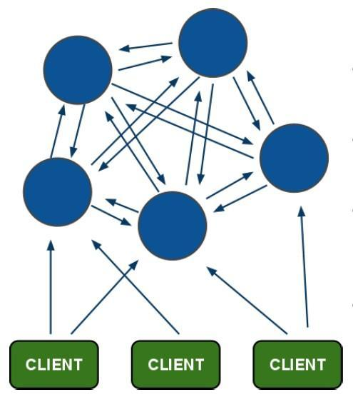

介绍
----
Redis 集群是一个可以在多个 Redis 节点之间进行数据共享的设施（installation）。

Redis 集群不支持那些需要同时处理多个键的 Redis 命令， 因为执行这些命令需要在多个 Redis 节点之间移动数据， 并且在高负载的情况下， 这些命令将降低 Redis 集群的性能， 并导致不可预测的错误。

Redis 集群通过分区（partition）来提供一定程度的可用性（availability）： 即使集群中有一部分节点失效或者无法进行通讯， 集群也可以继续处理命令请求。

Redis 集群提供了以下两个好处：

- 将数据自动切分（split）到多个节点的能力。
- 当集群中的一部分节点失效或者无法进行通讯时， 仍然可以继续处理命令请求的能力。

数据分片
----
Redis 集群使用数据分片（sharding）而非一致性哈希（consistency hashing）来实现： 一个 Redis 集群包含 16384 个哈希槽（hash slot）， 数据库中的每个键都属于这 16384 个哈希槽的其中一个， 集群使用公式 CRC16(key) % 16384 来计算键 key 属于哪个槽， 其中 CRC16(key) 语句用于计算键 key 的 CRC16 校验和 。

集群中的每个节点负责处理一部分哈希槽。 举个例子， 一个集群可以有三个哈希槽， 其中：

- 节点 A 负责处理 0 号至 5500 号哈希槽。
- 节点 B 负责处理 5501 号至 11000 号哈希槽。
- 节点 C 负责处理 11001 号至 16384 号哈希槽。
这种将哈希槽分布到不同节点的做法使得用户可以很容易地向集群中添加或者删除节点。 比如说：
我现在想设置一个key,叫my_name:

```
set my_name zhangguoji
```

按照Redis Cluster的哈希槽算法，CRC16('my_name')%16384 = 2412 那么这个key就被分配到了节点A上
同样的，当我连接(A,B,C)的任意一个节点想获取my_name这个key,都会转到节点A上
再比如
如果用户将新节点 D 添加到集群中， 那么集群只需要将节点 A 、B 、 C 中的某些槽移动到节点 D 就可以了。
增加一个D节点的结果可能如下：

- 节点A覆盖1365-5460
- 节点B覆盖6827-10922
- 节点C覆盖12288-16383
- 节点D覆盖0-1364,5461-6826,10923-1228
与此类似， 如果用户要从集群中移除节点 A ， 那么集群只需要将节点 A 中的所有哈希槽移动到节点 B 和节点 C ， 然后再移除空白（不包含任何哈希槽）的节点 A 就可以了。
因为将一个哈希槽从一个节点移动到另一个节点不会造成节点阻塞， 所以无论是添加新节点还是移除已存在节点， 又或者改变某个节点包含的哈希槽数量， 都不会造成集群下线。
所以,Redis Cluster的模型大概是这样的形状


主从复制模型
----
为了使得集群在一部分节点下线或者无法与集群的大多数（majority）节点进行通讯的情况下， 仍然可以正常运作， Redis 集群对节点使用了主从复制功能： 集群中的每个节点都有 1 个至 N 个复制品（replica）， 其中一个复制品为主节点（master）， 而其余的 N-1 个复制品为从节点（slave）。

在之前列举的节点 A 、B 、C 的例子中， 如果节点 B 下线了， 那么集群将无法正常运行， 因为集群找不到节点来处理 5501 号至 11000号的哈希槽。

另一方面， 假如在创建集群的时候（或者至少在节点 B 下线之前）， 我们为主节点 B 添加了从节点 B1 ， 那么当主节点 B 下线的时候， 集群就会将 B1 设置为新的主节点， 并让它代替下线的主节点 B ， 继续处理 5501 号至 11000 号的哈希槽， 这样集群就不会因为主节点 B 的下线而无法正常运作了。

不过如果节点 B 和 B1 都下线的话， Redis 集群还是会停止运作。

Redis一致性保证
----
Redis 并不能保证数据的强一致性. 这意味这在实际中集群在特定的条件下可能会丢失写操作：第一个原因是因为集群是用了异步复制. 写操作过程:

- 客户端向主节点B写入一条命令.
- 主节点B向客户端回复命令状态.
- 主节点将写操作复制给他得从节点 B1, B2 和 B3

主节点对命令的复制工作发生在返回命令回复之后， 因为如果每次处理命令请求都需要等待复制操作完成的话， 那么主节点处理命令请求的速度将极大地降低 —— 我们必须在性能和一致性之间做出权衡。 注意：Redis 集群可能会在将来提供同步写的方法。 Redis 集群另外一种可能会丢失命令的情况是集群出现了网络分区， 并且一个客户端与至少包括一个主节点在内的少数实例被孤立。
举个例子 假设集群包含 A 、 B 、 C 、 A1 、 B1 、 C1 六个节点， 其中 A 、B 、C 为主节点， A1 、B1 、C1 为A，B，C的从节点， 还有一个客户端 Z1 假设集群中发生网络分区，那么集群可能会分为两方，大部分的一方包含节点 A 、C 、A1 、B1 和 C1 ，小部分的一方则包含节点 B 和客户端 Z1 .
Z1仍然能够向主节点B中写入, 如果网络分区发生时间较短,那么集群将会继续正常运作,如果分区的时间足够让大部分的一方将B1选举为新的master，那么Z1写入B中得数据便丢失了.
注意， 在网络分裂出现期间， 客户端 Z1 可以向主节点 B 发送写命令的最大时间是有限制的， 这一时间限制称为节点超时时间（node timeout）， 是 Redis 集群的一个重要的配置选项