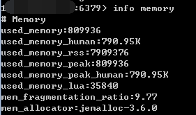

# 深入学习Redis（1）：Redis内存模型
转载： <https://www.cnblogs.com/kismetv/p/8654978.html>

## 一、Redis内存统计
工欲善其事必先利其器，在说明Redis内存之前首先说明如何统计Redis使用内存的情况。

在客户端通过redis-cli连接服务器后（后面如无特殊说明，客户端一律使用redis-cli），通过info命令可以查看内存使用情况：
```shell script
[root@hb-dev01 bin]# ./redis-cli
127.0.0.1:6379> info memory
# Memory
used_memory:6437904
used_memory_human:6.14M
used_memory_rss:14569472
used_memory_rss_human:13.89M
used_memory_peak:11463622
used_memory_peak_human:10.93M
used_memory_peak_perc:56.16%
used_memory_overhead:3013276
used_memory_startup:835308
used_memory_dataset:3424628
used_memory_dataset_perc:61.13%
total_system_memory:8202498048
total_system_memory_human:7.64G
used_memory_lua:38912
used_memory_lua_human:38.00K
maxmemory:0
maxmemory_human:0B
maxmemory_policy:noeviction
mem_fragmentation_ratio:2.26
mem_allocator:libc
active_defrag_running:0
lazyfree_pending_objects:0
```



其中，info命令可以显示redis服务器的许多信息，包括服务器基本信息、CPU、内存、持久化、客户端连接信息等等；memory是参数，表示只显示内存相关的信息。

返回结果中比较重要的几个说明如下：

- used_memory：Redis分配器分配的内存总量（单位是字节），包括使用的虚拟内存（即swap）；Redis分配器后面会介绍。used_memory_human只是显示更友好。

- used_memory_rss：Redis进程占据操作系统的内存（单位是字节），与top及ps命令看到的值是一致的；除了分配器分配的内存之外，used_memory_rss还包括进程运行本身需要的内存、内存碎片等，但是不包括虚拟内存。

因此，used_memory和used_memory_rss，前者是从Redis角度得到的量，后者是从操作系统角度得到的量。二者之所以有所不同，一方面是因为内存碎片和Redis进程运行需要占用内存，使得前者可能比后者小，另一方面虚拟内存的存在，使得前者可能比后者大。

由于在实际应用中，Redis的数据量会比较大，此时进程运行占用的内存与Redis数据量和内存碎片相比，都会小得多；因此used_memory_rss和used_memory的比例，便成了衡量Redis内存碎片率的参数；这个参数就是mem_fragmentation_ratio。

## Redis内存划分
Redis作为内存数据库，在内存中存储的内容主要是数据（键值对）；通过前面的叙述可以知道，除了数据以外，Redis的其他部分也会占用内存。

Redis的内存占用主要可以划分为以下几个部分：

- 1、数据
作为数据库，数据是最主要的部分；这部分占用的内存会统计在used_memory中。

Redis使用键值对存储数据，其中的值（对象）包括5种类型，即字符串、哈希、列表、集合、有序集合。这5种类型是Redis对外提供的，实际上，在Redis内部，每种类型可能有2种或更多的内部编码实现；此外，Redis在存储对象时，并不是直接将数据扔进内存，而是会对对象进行各种包装：如redisObject、SDS等；这篇文章后面将重点介绍Redis中数据存储的细节。

- 2、进程本身运行需要的内存
Redis主进程本身运行肯定需要占用内存，如代码、常量池等等；这部分内存大约几兆，在大多数生产环境中与Redis数据占用的内存相比可以忽略。这部分内存不是由jemalloc分配，因此不会统计在used_memory中。

补充说明：除了主进程外，Redis创建的子进程运行也会占用内存，如Redis执行AOF、RDB重写时创建的子进程。当然，这部分内存不属于Redis进程，也不会统计在used_memory和used_memory_rss中。

- 3、缓冲内存
缓冲内存包括客户端缓冲区、复制积压缓冲区、AOF缓冲区等；其中，客户端缓冲存储客户端连接的输入输出缓冲；复制积压缓冲用于部分复制功能；AOF缓冲区用于在进行AOF重写时，保存最近的写入命令。在了解相应功能之前，不需要知道这些缓冲的细节；这部分内存由jemalloc分配，因此会统计在used_memory中。

- 4、内存碎片
内存碎片是Redis在分配、回收物理内存过程中产生的。例如，如果对数据的更改频繁，而且数据之间的大小相差很大，可能导致redis释放的空间在物理内存中并没有释放，但redis又无法有效利用，这就形成了内存碎片。内存碎片不会统计在used_memory中。

内存碎片的产生与对数据进行的操作、数据的特点等都有关；此外，与使用的内存分配器也有关系：如果内存分配器设计合理，可以尽可能的减少内存碎片的产生。后面将要说到的jemalloc便在控制内存碎片方面做的很好。

如果Redis服务器中的内存碎片已经很大，可以通过安全重启的方式减小内存碎片：因为重启之后，Redis重新从备份文件中读取数据，在内存中进行重排，为每个数据重新选择合适的内存单元，减小内存碎片。