大家好，很高兴在这里和大家进行微课堂的分享，今天进行分享的主题是《微服务架构下的分布式Session管理》。

主要大纲：

一、应用架构变迁下的Session管理

二、微服务架构下的Session管理

三、Session管理实践分享

一、应用架构变迁下的Session管理

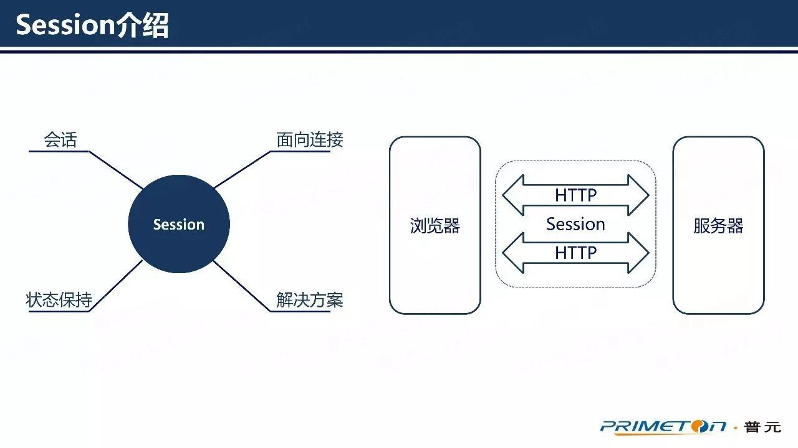

Session一词直译为“会话”，意指有始有终的一系列动作／消息。Session是Web应用蓬勃发展的产物之一，在Web应用中隐含有“面向连接”和“状态保持”两个含义，同时也指代了Web服务器与客户端之间进行状态保持的解决方案。

在Web应用诞生之初，应用服务器与浏览器之间仅仅只是基于HTTP协议进行通信。而HTTP协议是无状态的，也就是说每一个请求之间都是相互独立的，互不关联。但是随着应用业务复杂化，服务器需要按照用户的一系列业务操作向用户提供某些特定的、按需的内容。这时候就需要通过保存用户状态，将用户的请求关联起来。Session管理正是这一问题的解决方案。

早期的Web应用基本都采用的是单体架构，也就是把一个使用了分层架构的Web应用部署在单节点Web服务器上的架构类型。在这种架构中，虽然采用了分层架构，将整个应用分为了表现层、业务逻辑层和数据访问层，每一层各司其职，让Web应用的各个方面都有所改善。但这样的分层只是停留于逻辑上。由于将所有代码部署在单个服务器节点上，随着应用不断迭代开发，单体应用将会发展成巨石型应用，臃肿不堪，难以维护。

在这样的单体架构中，由于所有的用户请求都是由这个唯一的服务器进行响应处理，所以只要把保存了用户信息和状态的Session对象，存放在应用服务器内存里，就能轻松地达到保持用户状态的目的。

随着Web应用的发展，用户访问量和业务复杂度与日俱增，应用的性能和代码的维护难度成为应用的瓶颈，为了突破瓶颈，开发者开始尝试在应用架构中引入负载均衡器，继而演化出了集群和分布式两种架构类型。

集群，是指在多个服务器节点上部署相同的应用，例如上图中的服务器B和C，然后通过负载均衡器的分发功能，把用户请求分发到集群中的任意一个服务器节点上。如果有更大的访问量，只要向集群中增加服务器节点，就能改善压力。集群既能保证应用的高可用，又能提高应用的负载能力。

分布式，是把原来的单体架构应用，通过分而治之的手段，按照业务功能，切分成一些小的模块应用，部署在不同服务器节点上，例如上图中的服务器A和B。然后通过负载均衡器和门户应用整合起来，组成一个完整的应用。
集群和分布式架构中，后端包含了多个服务器节点。当用户进行登录时，登录请求是由其中一个服务器节点进行响应，而后续的用户请求将可能被负载均衡器分发到其他服务器节点，这时候就可能因为这个服务器节点上没有用户Session，导致服务器判定用户是未登录状态，让用户重新登录。

所以，在集群和分布式架构中，必须保证用户进行登陆后，架构中的所有服务器节点都能共享Session数据。常用的Session管理方案有如下3种：

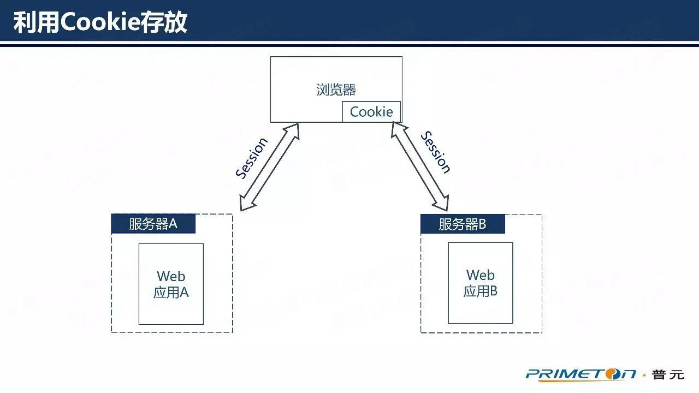

1、将Session对象保存在Cookie，然后存放在浏览器端。每次浏览器向服务器发送请求的时候，都会把整个Session对象放在请求里一起发送到服务器，以此来实现Session共享。这样的方案实现起来特别方便，但是由于Cookie的存储容量比较小，所以这个方案只适用于Session数据量小的场景。

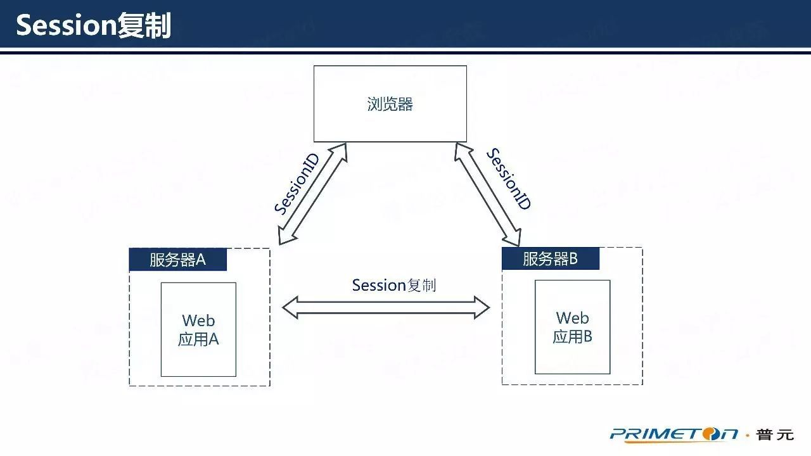

2、Session复制。部分应用服务器能够支持Session复制功能，例如Tomcat。用户可以通过修改配置文件，让应用服务器进行Session复制，保持每一个服务节点的Session数据达到一致。但是这个方案的实现依赖于应用服务器。当应用被大量用户访问时，每个服务器都需要有一部分内存用来存放Session，同时因为大量Session通过网路传输进行复制，将会占用网络资源，还可能因为网络延迟导致程序异常。

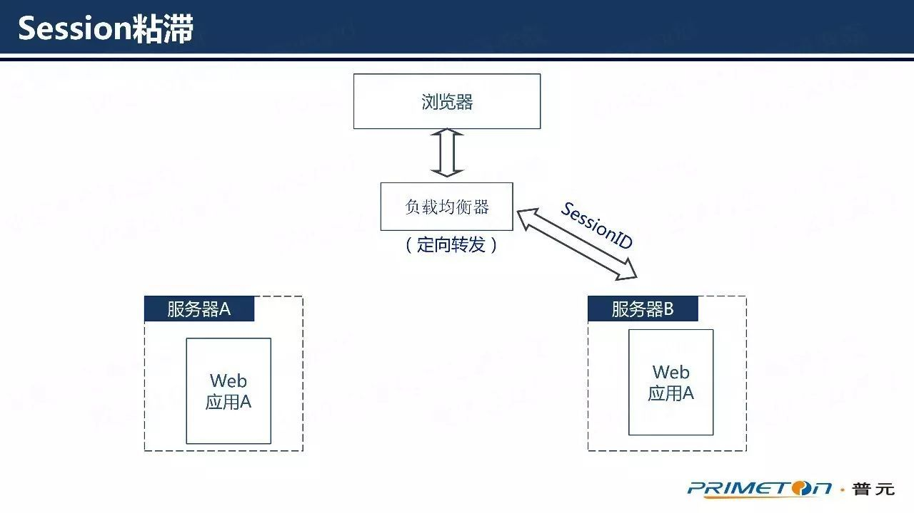

3、Session粘滞。利用负载均衡器的分发能力，将同一浏览器上同一用户的请求，都定向发送到固定服务器上，让这个服务器处理该用户的所有请求，这样只要这个服务器上保存了用户Session，就能保证用户的状态一致性。但是这个方案依赖于负载均衡器，而且只适用于横向扩展的集群场景，不能满足分布式场景。

二、微服务架构下的Session管理

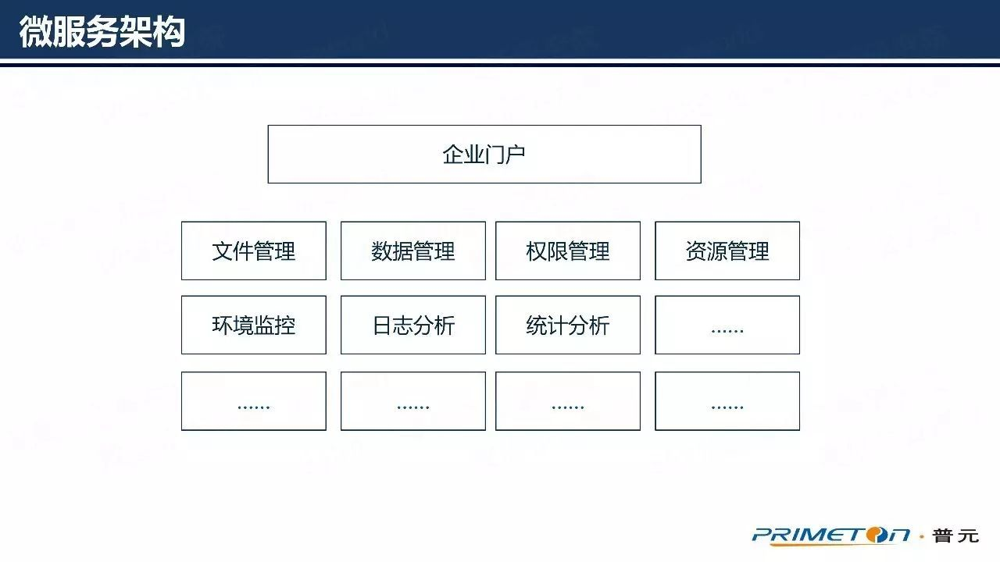

微服务架构是将一个应用拆分成一套小而相互关联的微服务，微服务之间通过暴露出来的API被其他微服务或系统所调用。在运行时 ，每个微服务实例通常是一个云虚拟机或者一个Docker。众多微服务综合起来，构成了一个完整的微服务架构应用。

微服务架构中的微服务一般可以分为两类：无状态服务和有状态服务。无状态服务比如应用服务器提供的公共服务，通常不保存数据，方便进行横向扩展。有状态服务则需要进行数据存储，例如数据库服务和缓存服务。在Web应用中，Session用来存储用户状态信息，所以Session管理也是有状态服务的一种。

微服务架构可以近似地看做是一个大型的分布式架构系统，但是与分布式架构相比，微服务架构让应用模块的划分更为精细，每个微应用大小合适，方便进行维护和管理。通过使用devops平台，可以让微服务模块的开发部署变得很敏捷。

当应用由十几个甚至数十个部署在不同节点上的微服务组成时，如果还是沿用分布式架构中的Session管理方案，将会让Session管理的复杂度直线上升，同时很难保证整个架构中Session数据的一致性。

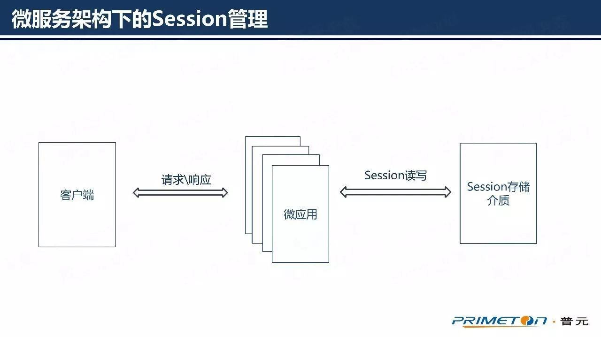

因此，在微服务架构下的Session管理，我们应该另辟蹊径，不再将Session对象保存在服务器的内存里，而是在应用架构中引入独立的中间存储介质，将整个应用架构中的Session对象进行统一管理。

个人认为，一个好的Session集中管理方案，应该具备以下4个特点：

中间存储介质的读写速度要快。因为使用了Session集中管理后，将会在Session的读写操作中引入网络传输，与保存在服务器本地内存相比，读写速率会有所下降，所以必须保证中间存储介质的读写速度。
中间存储介质要高可用。整个应用架构中的Session对象都将被保存在中间存储介质中，如果不能保证存储介质的高可用，整个应用都将变得不稳定。
Session管理方案要保证对用户的透明性，切换成集中管理后 ，对用户的使用应该是不会与影响的，用户使用的时候对方案改变无感知。
管理方案不该和某一应用服务器耦合，应该适用于所有常规应用服务器。
从上述特点可以看出，Session集中管理的技术选型，应该从Session存储介质和管理方案实现两方面进行考虑。

三、Session管理实践分享

因为Session存储介质需要有较高的读写性能，所以应该选择缓存服务器作为存储介质。我们在进行微服务Session管理实践的时候，对目前业内常用的两种缓存服务器，Redis和Memcache，进行了对比，准备在两者之中选一个合适的缓存服务器来进行Session存储。

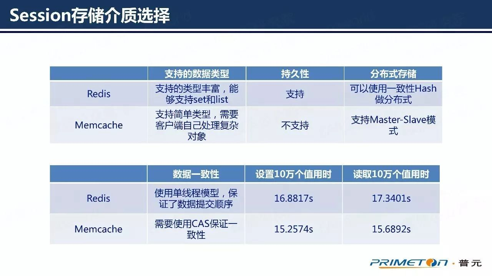

从表中的数据可能看出，虽然Redis的读写性能稍弱于Memcache，但是Redis支持的数据类型较多，而且支持数据的持久化。

此外，Memcache使用Slab Allocation机制进行内存管理，通过将内存分隔成特定长度块来解决内存碎片问题。同时Memcache采用最近最少使用（LRU）算法对slab进行内存回收。这就意味着，如果所有Session对象的大小大致相同，将会被Memcache存放在大小合适的slab中进行存储，一但这些slab被存满，再有新的数据进来，里面的存放的时间相对较早的Session对象就会被清除，导致用户变成未登录状态。

对比之后发现Redis更加适合用于Session存储。而且Redis3.0之后，提供了良好的主从复制和集群能力，能够很好地保证Session存储的高可用。Redis还提供了数据失效和订阅通知的能力，能为Session共享提供良好的支撑。

在Session集中管理方案的实现上，目前常用的方案有两种，一种是Memcache-Tomcat-Session，另一种是Spring Session。

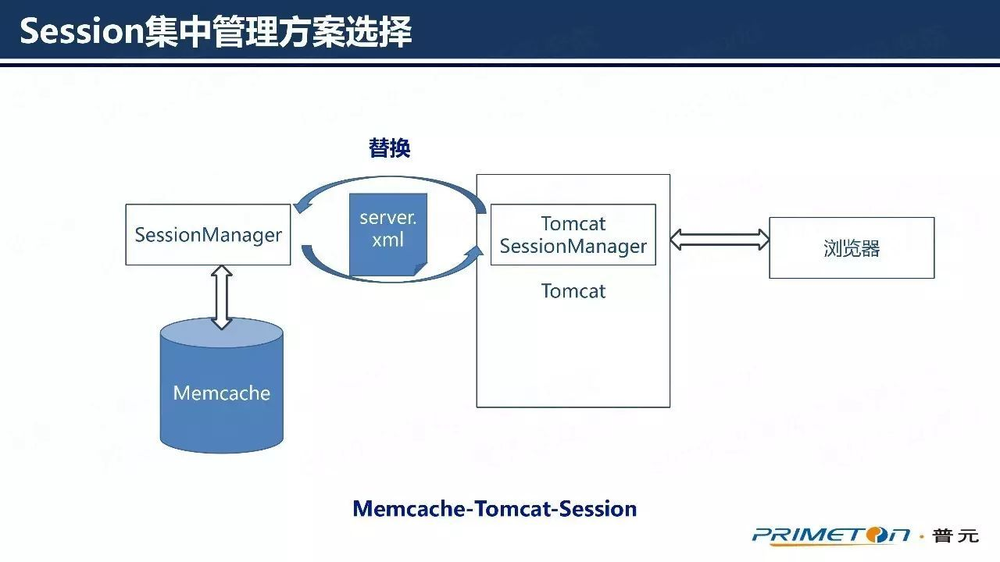

Memcache-Tomcat-Session是一个基于Memcache和Tomcat实现Session集中管理的开源方案，通过修改Tomcat的server.xml文件，使用扩展的SessionManager替换Tomcat原有的Session管理器来实现集中管理。这个方案实现起来比较简单，但是与Tomcat耦合，不适用于其他应用服务器。

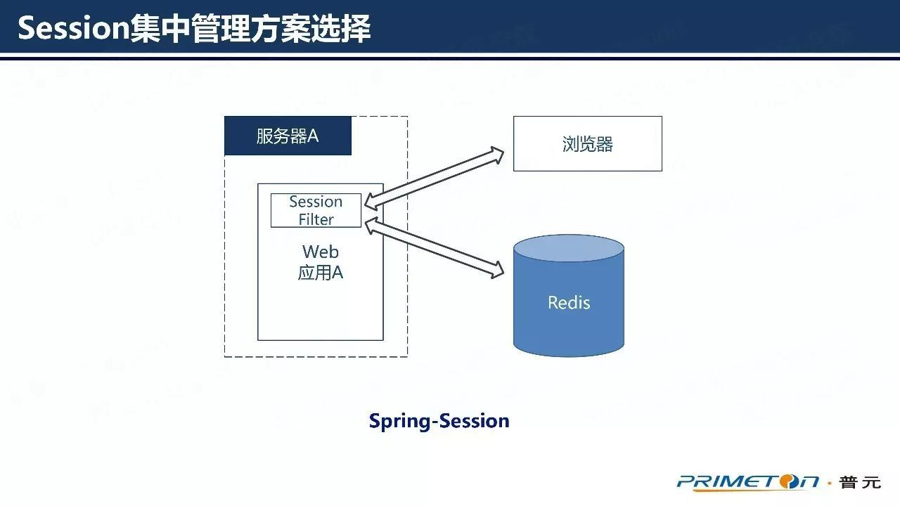

Spring Session是Spring提供的一套Session管理方案，通过一个SessionFilter将所有访问应用的请求都拦截下来，然后使用Request包装类接管Session管理。SpringSession不与应用服务器耦合，能适用于常规服务器。同时还提供了在浏览器下对同一应用存储多个Session等功能。

SpringSession优点颇多，所以开始的时候我们曾尝试将SpringSession集成到公司产品中来，进行Session集中管理，但在集成过程中考虑到以下几点，最终放弃了集成。

SpringSession功能丰富，但我们并不是都需要。
SpringSession的实现代码量较多，还需要配合Spring-data-redis进行使用。如果后续要对Session管理的代码进行修改维护，需要把SpringSession的代码都梳理一遍，学习维护成本比较高。
所以最终我们决定使用Redis作为Session的存储介质，然后参考SpringSession的实现理念，自己设计开发一套轻量级的Session集中管理实现。

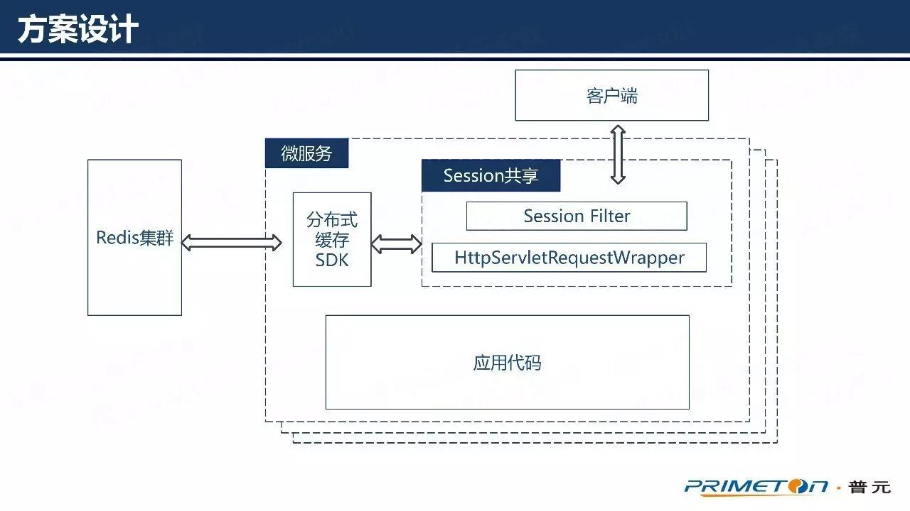

同样使用SessionFilter进行用户请求拦截，然后通过Request包装类接管应用服务器的Session管理。在Request包装类中重写getSession方法。让用户在进行Session读写的时候去Redis中进行操作，而且使用Session的方法与过去一样，使得管理方案对用户透明。

在Session共享模块与Redis之间，基于jedis开发了一个分布式缓存SDK，用于进行通信，同时SDK可以提供扩展性，后续如果需要支持其他的缓存服务器，只要对SDK进行扩展开发即可。

然后为了保证Session集中管理方案的高可用，将会搭建Redis集群来存储Session对象。

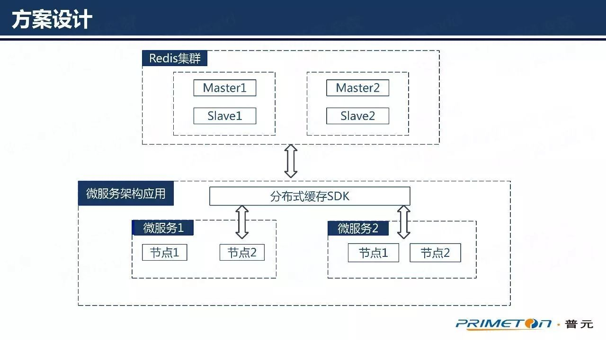

这是一个推荐客户搭建的最小Redis集群，集群中共有4个Redis节点，两主两从。两个Master节点用来对Session数据进行分片存储，而Slaver节点用来对Matser进行数据备份和读写分离。

总结

