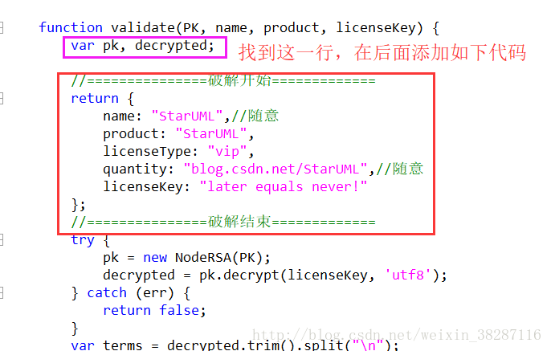

### 1. 打开软件安装路径，找到指定配置文件


### 2. 编辑上边的js文件


 ```
//===============破解开始=============  
     return {  
         name: "StarUML",//随意  
         product: "StarUML",  
         licenseType: "vip",  
         quantity: "blog.csdn.net/StarUML",//随意  
         licenseKey: "later equals never!"  
     };  
 //===============破解结束=============  
```

### 3. 打开StarUML软件，点击Help 

再点击“Enter License”，输入如下：
```
Name:        StarUML  
Licence Key: 8888-000-8888 
```
看到如下结果，则表示注册成功 
