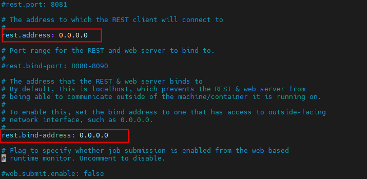

# flink安装
## 一、本地模式安装
### 1. 下载

下载地址：https://ververica.github.io/flink-cdc-connectors/master/content/downloads.html

### 2. 安装

为了运行Flink，只需提前安装好 Java 11。你可以通过以下命令来检查 Java 是否已经安装正确。

java -version
下载 release 1.18.0 并解压。
```shell
$ tar -xzf flink-1.18.0-bin-scala_2.12.tgz
$ cd flink-1.18.0-bin-scala_2.12
```

### 3. 启动集群

Flink 附带了一个 bash 脚本，可以用于启动本地集群。
```shell
$ ./bin/start-cluster.sh
Starting cluster.
Starting standalonesession daemon on host.
Starting taskexecutor daemon on host.
```

### 4. 管理系统

你可以通过 Flink 的 Web UI 来监视集群的状态和正在运行的作业。
打开浏览器，访问http://localhost:8081，即可看到Flink的Web UI。
> 正常启动集群后，只能通过http://localhost:8081访问Flink Web UI，如果通过IP地址访问，则出现连接被拒绝的情况。
> 此时需要修改Flink配置文件flink-conf.yaml，将localhost改成0.0.0.0，修改之后重启服务就可以使用IP地址访问。
> 