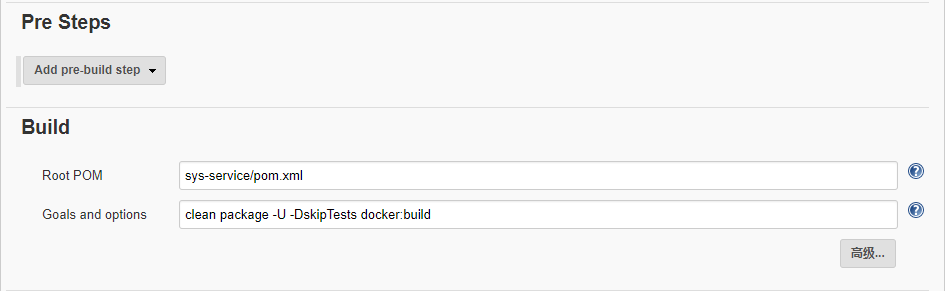

### 新建任务

新建一个maven项目

### 通用配置


### 源码管理配置


### 构建配置



### 构建后操作配置


其中用到的shell脚本为：
```
# sys-01的容器启动的就停止
if sudo docker ps |grep -i sys-01;then
   sudo docker stop sys-01
fi

sleep 1

# sys-01的容器存在就删除
if sudo docker ps -a|grep -i sys-01;then
   sudo docker rm -f sys-01
fi

sleep 1

# 创建一个sys-01的容器并运行
# 此处需注意run后边的-i不能写成-it,机上t会提示错误the input device is not a TTY
sudo docker run -i --name sys-01 --network host sofn/sys-service:latest

sleep 10

# 显示sys-01容器启动日志
sudo docker logs sys-01

# 删除无效的none镜像
sudo docker rmi $(docker images -f "dangling=true" -q)
```