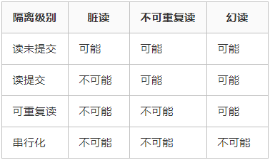

MySQL 事务
本文所说的 MySQL 事务都是指在 InnoDB 引擎下，MyISAM 引擎是不支持事务的。

数据库事务指的是一组数据操作，事务内的操作要么就是全部成功，要么就是全部失败，什么都不做，其实不是没做，是可能做了一部分但是只要有一步失败，就要回滚所有操作，有点一不做二不休的意思。

假设一个网购付款的操作，用户付款后要涉及到订单状态更新、扣库存以及其他一系列动作，这就是一个事务，如果一切正常那就相安无事，一旦中间有某个环节异常，那整个事务就要回滚，总不能更新了订单状态但是不扣库存吧，这问题就大了。

事务具有原子性（Atomicity）、一致性（Consistency）、隔离性（Isolation）、持久性（Durability）四个特性，简称 ACID，缺一不可。今天要说的就是隔离性。

概念说明
以下几个概念是事务隔离级别要实际解决的问题，所以需要搞清楚都是什么意思。

脏读

脏读指的是读到了其他事务未提交的数据，未提交意味着这些数据可能会回滚，也就是可能最终不会存到数据库中，也就是不存在的数据。读到了并一定最终存在的数据，这就是脏读。

可重复读

可重复读指的是在一个事务内，最开始读到的数据和事务结束前的任意时刻读到的同一批数据都是一致的。通常针对数据更新（UPDATE）操作。

不可重复读

对比可重复读，不可重复读指的是在同一事务内，不同的时刻读到的同一批数据可能是不一样的，可能会受到其他事务的影响，比如其他事务改了这批数据并提交了。通常针对数据更新（UPDATE）操作。

幻读

幻读是针对数据插入（INSERT）操作来说的。假设事务A对某些行的内容作了更改，但是还未提交，此时事务B插入了与事务A更改前的记录相同的记录行，并且在事务A提交之前先提交了，而这时，在事务A中查询，会发现好像刚刚的更改对于某些数据未起作用，但其实是事务B刚插入进来的，让用户感觉很魔幻，感觉出现了幻觉，这就叫幻读。

事务隔离级别
SQL 标准定义了四种隔离级别，MySQL 全都支持。这四种隔离级别分别是：

读未提交（READ UNCOMMITTED）
读提交 （READ COMMITTED）
可重复读 （REPEATABLE READ）
串行化 （SERIALIZABLE）

从上往下，隔离强度逐渐增强，性能逐渐变差。采用哪种隔离级别要根据系统需求权衡决定，其中，可重复读是 MySQL 的默认级别。

事务隔离其实就是为了解决上面提到的脏读、不可重复读、幻读这几个问题，下面展示了 4 种隔离级别对这三个问题的解决程度。

只有串行化的隔离级别解决了全部这 3 个问题，其他的 3 个隔离级别都有缺陷。