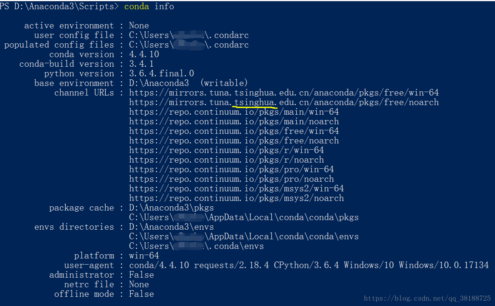

> 对于初学者来说，原版的python在使用的时候非常麻烦，特别是在添加库、升级库的时候总是会报好多错误，缺这缺那。但是自从有了Anaconda
以后，妈妈再也不用担心我用不了python啦！
> Anaconda相当于一个python的整合包，是一个开源的python发行版本，里面有各种科学包和依赖项，使用起来非常简单。

# 1. 安装
下载地址：<https://www.anaconda.com/download/>

选择你需要的配置进行下载，然后依照提示一步一步安装就可以了。安装完成后，打开cmd命令行窗口，输入python，出现如下信息则表示安装成
功。

这里可以使用命令行编写代码，也可以使用python原生的IDE编写，但是编辑的感觉都非常不好。在安装完Anaconda后会发现电脑里多出了一个叫
做Jupyter Notebook的软件。这是Anaconda自带的python编辑器，非常好用，也是这里推荐的IDE。另一个推荐的IDE是JetBrains的Intellij 
Idea，它不仅仅是java的IDE，还是当今世界大部分主流高级语言的IDE。

# 2. 配置环境变量
主要有三个环境的配置:
> anaconda安装路径（为了Python检查正常）:前面安装时路径一定要记清楚，之前已提醒复制，我的是D:\Python\install\Anaconda3

> 安装路径\Scripts（为了conda检查正常）:只需在上述路径中找到Scripts，然后复制路径即可，我的路径是D:\Python\install\Anaconda3\Scripts

> 另一个路径（加不加不知道有什么区别，不影响后边的检查）：安装路径\Library\bin，如我的是D:\Python\install\Anaconda3\Library\bin

上述三个环境变量都是通过：此电脑—右键—高级系统设置—环境变量—系统变量—双击path—新建这两个变量即可。

# 3. 安装pip
pip是python的强大功能之一，有了它就可以为所欲为地在命令行中下载各种库。在Anaconda的安装目录下找到Scripts文件夹并进入，然后shift
右键，选择在此处打开Powershell窗口，输入以下命令：
```shell script
python -m pip install -U pip
```

就可以将pip升级到最新版，然后就可以使用了。使用方法如下：
```shell script
pip install numpy
```
稍等片刻即可安装成功。

有时下载特别慢，是因为Anaconda默认的镜像源在国外，非常不稳定。这里可以换成清华的镜像源，下载速度可以提升将近10倍。

# 4. 配置国内镜像源
首先建立配置文件：
windows下的路径为 C:\Users\你的用户名\pip\pip.ini

linux下的路径为 ~/.pip/pip.conf

内容为：
```shell script
[global]
index-url = https://pypi.tuna.tsinghua.edu.cn/simple
[install]
trusted-host=pypi.tuna.tsinghua.edu.cn
```

然后在之前提到的Scripts下打开命令行窗口，输入如下命令：
```shell script
conda config --add channels https://mirrors.tuna.tsinghua.edu.cn/anaconda/pkgs/free/
conda config --set show_channel_urls yes
```
镜像源的切换完成。检测方法是在命令行输入命令conda info，如下图：

可以看到镜像源已经指向清华。