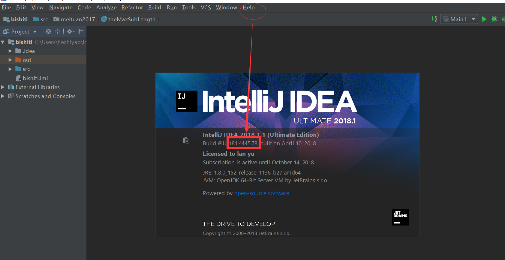
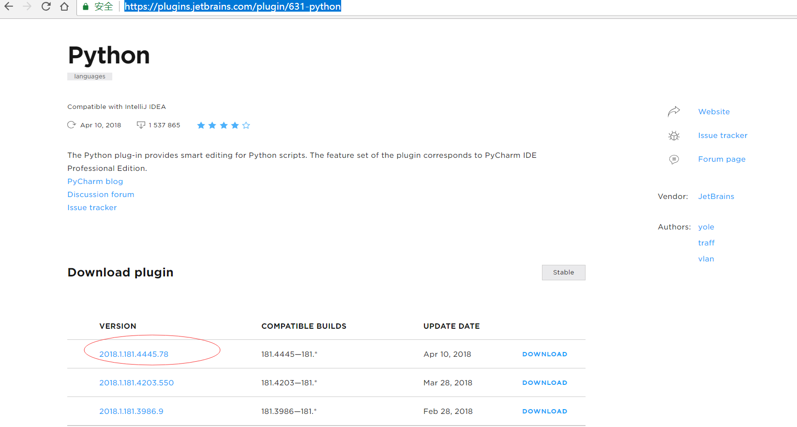

# 1. idea中直接安装Python插件
通过file-->settings-->Plugins 安装python时，会提示下载失败。可以采用以下方法解决。

# 2. 手动安装
## 2.1 在idea菜单中help/about中查看IDEA版本，作者的是181.4445

## 2.2 在<https://plugins.jetbrains.com/plugin/631-python> 中下载 对应版本的python插件

## 2.3 file-->settings-->Plugins中选择磁盘安装，选择下载的插件包，重启idea

## 2.4 点击File/New Project/Python，设置Project  SDK ，创建Python项目

