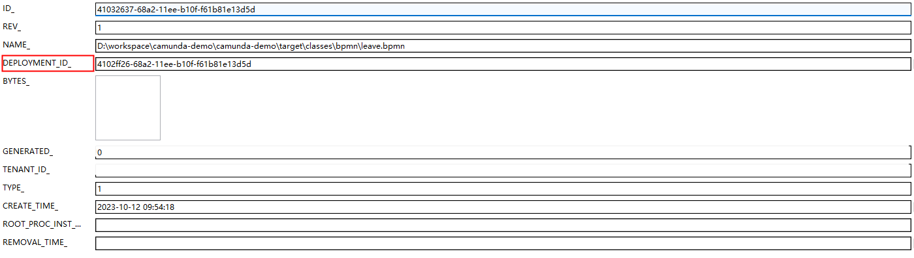
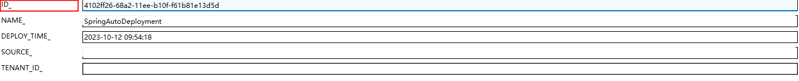
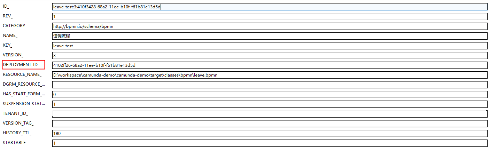
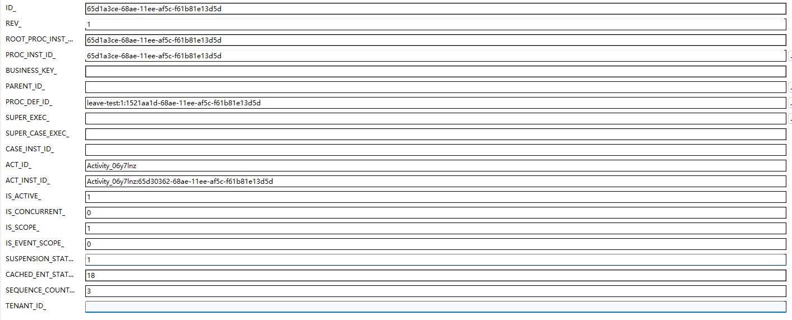

## 流程部署
### 表：act_ge_bytearray

>流程部署后会在act_ge_bytearray表中生成流程二进制数据，并记录流程部署ID。

### 表：act_re_deployment

>在act_re_deployment表中生成一条流程部署记录，记录Id会写入act_ge_bytearray表中的DEPLOYMENT_ID_字段

### 表：act_re_procdef

>生成一条流程定义记录，流程定义记录中记录流程部署ID

## 启动流程
### 表：act_ru_execution

>增加一条流程实例记录
> + 